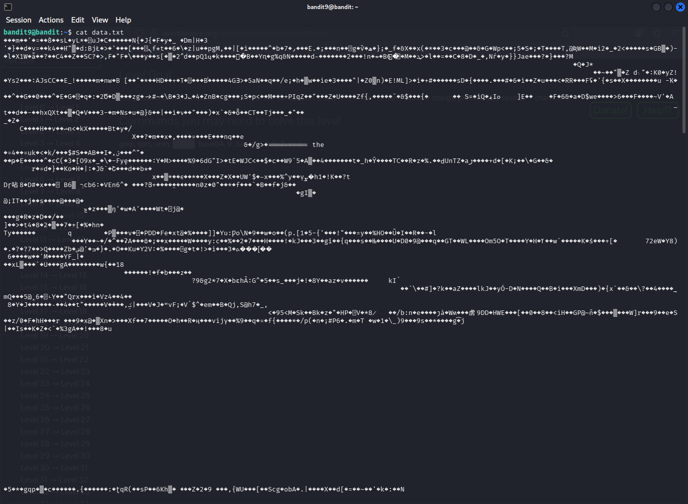

# Bandit Level 9=> Level 10 | OverTheWire
## Description
The password for the next level is stored in the file data.txt in one of the few human-readable strings, preceded by several ‘=’ characters.

## Analysis
The given machine has `data.txt` file which is not human-readible. However, as description says, it does have a few human-readible strings. We know that the password is next to the several "=" characters. This is what it looks like when we try to open raw file:


## Solution
To solve this problem, we just have to use command `strings` and pipe it with `grep` command.

The snippet will look like this:
```bash
bandit9@bandit:~$ strings data.txt | grep "=="
========== the
========== password
f\Z'========== is
========== FGUW5il-------------------
bandit9@bandit:~$ 
```
In this command, `strings` outputs the printable strings, which we needed. And to specify the output more, we used `grep` with given information about "=" characters. This is how we solve this CTF!
