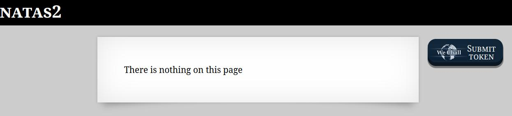
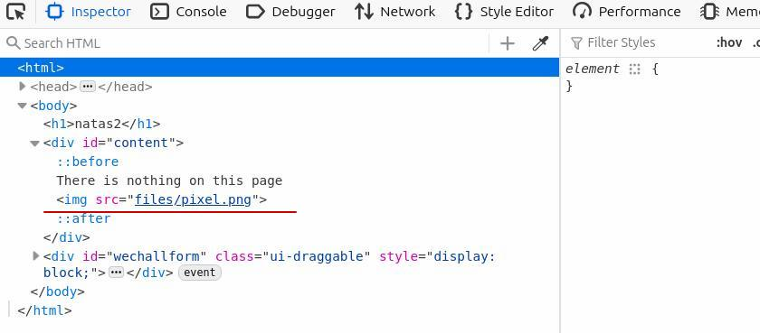
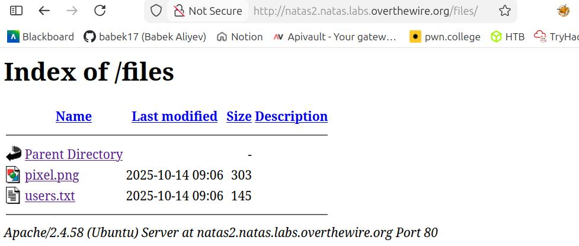
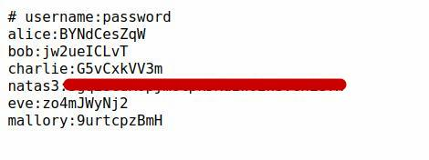

🕵️ Natas Level 2 → Level 3 Walkthrough

The page initially displays the message “There is nothing on this page.”

However, we should never trust what the frontend shows.

Inspect the page source

Open the browser developer tools (Ctrl + Shift + I)

In the HTML <body> section, there is an image tag:

Identify hidden directory

The image path reveals a folder named files

Navigate to /files in the browser

Explore the directory contents

Inside the directory, a file named user.txt is available

Retrieve the password

Open user.txt

The password for natas3 is stored inside