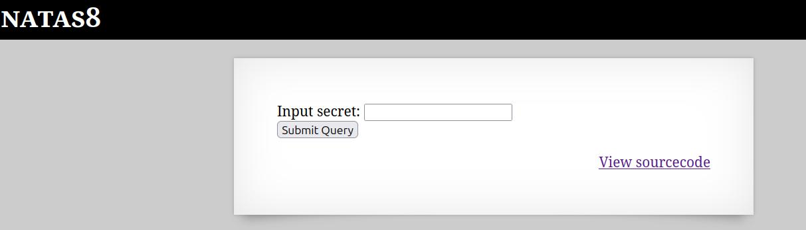
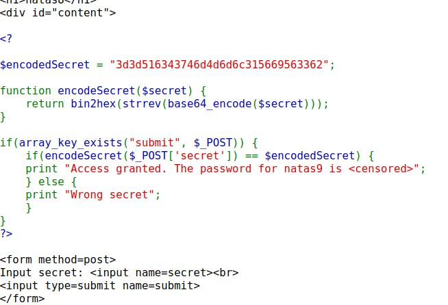
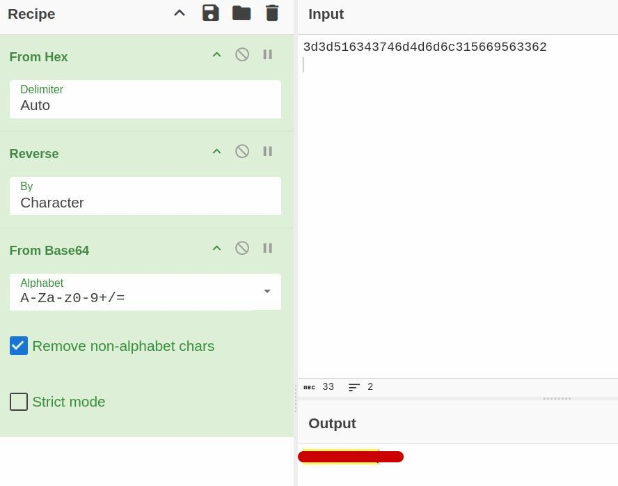
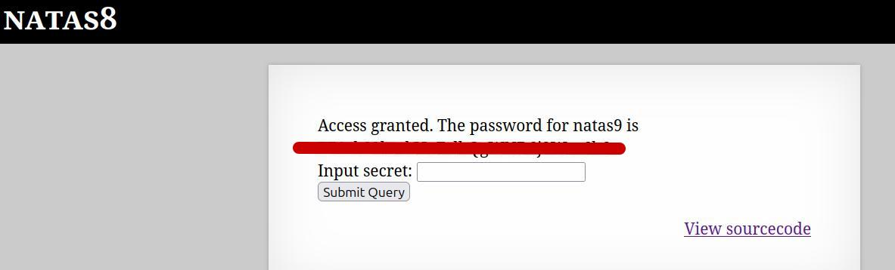

🕵️ Natas Level 8 → Level 9 Walkthrough

This level again presents an input field along with a “View sourcecode” option.
However, the underlying logic differs from the previous level.

1. Analyze the source code

Click “View sourcecode” to review the PHP code

A variable named encodedSecret is defined with a fixed value

Below it, a function is shown that transforms the original secret

The function performs the following operations in order:

Encodes the input using Base64

Reverses the encoded string

Converts the result to hexadecimal

2. Reverse the transformation

To recover the original secret, the operations must be undone in reverse order:

Convert hex → text

Reverse the string

Decode Base64

A convenient way to perform this is using CyberChef, applying the decoding steps from left to right in reverse order of the original function.

3. Retrieve and submit the secret

After reversing the transformations, the original secret value is obtained

Enter this secret into the input field on the original page

4. Obtain the password

Upon successful validation, the application reveals the password for natas9