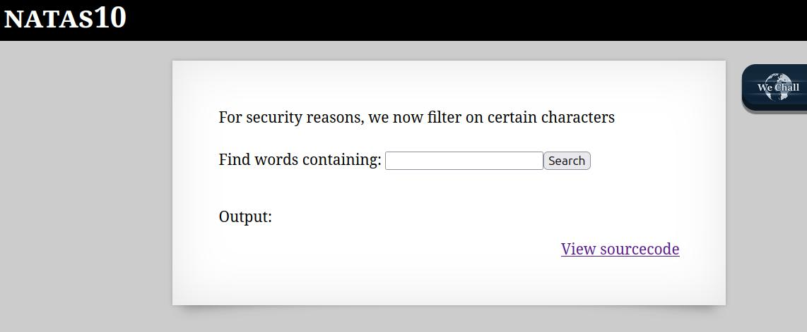
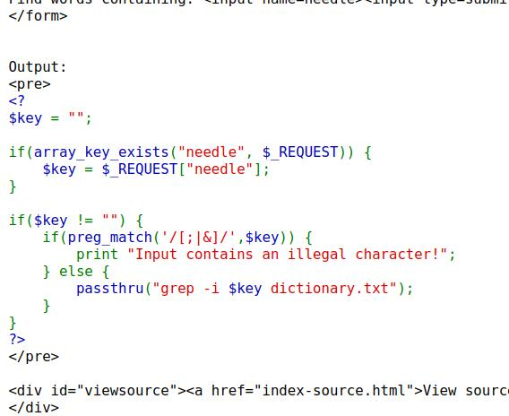

🕵️ Natas Level 10 → Level 11 Walkthrough

The webpage provides a search field labeled “Find words containing:” and a “View sourcecode” option at the bottom.

1. Analyze the source code

Clicking “View sourcecode” reveals the following PHP code:

Unlike the previous level, this challenge applies input filtering that blocks shell metacharacters such as ;, |, and &.
As a result, direct command injection is no longer possible.

Although command separators are filtered, the input is still directly embedded into the grep command without validation.

The executed command follows this structure:

grep -i 'pattern' 'file1' 'file2' ...

The first argument is treated as the search pattern and any additional arguments are treated as filenames. This allows us to inject additional files for grep to read.

Using the input:

. /etc/natas_webpass/natas11

The resulting command becomes:

grep -i . /etc/natas_webpass/natas11 dictionary.txt

Explanation:

. is a regular expression that matches any character

grep prints all non-empty lines

/etc/natas_webpass/natas11 is now treated as an additional file to search

This causes grep to output the contents of the password file.

The output reveals the password for natas11

Any additional output from dictionary.txt can be ignored