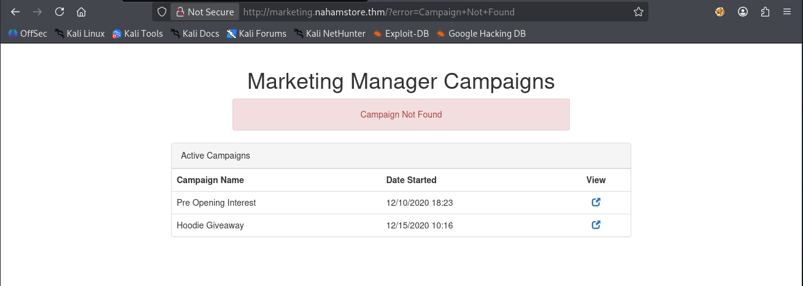
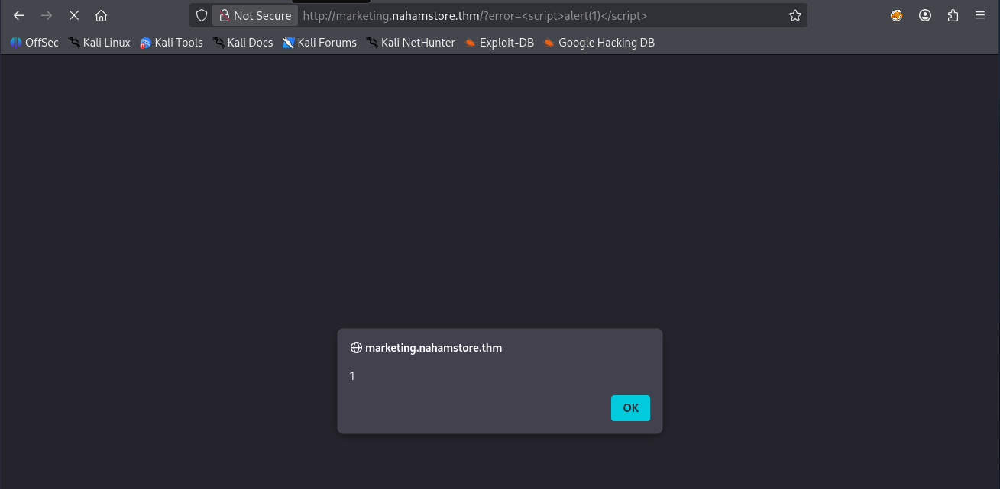
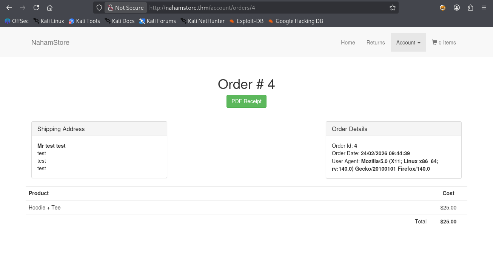
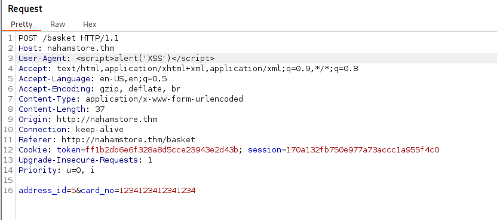
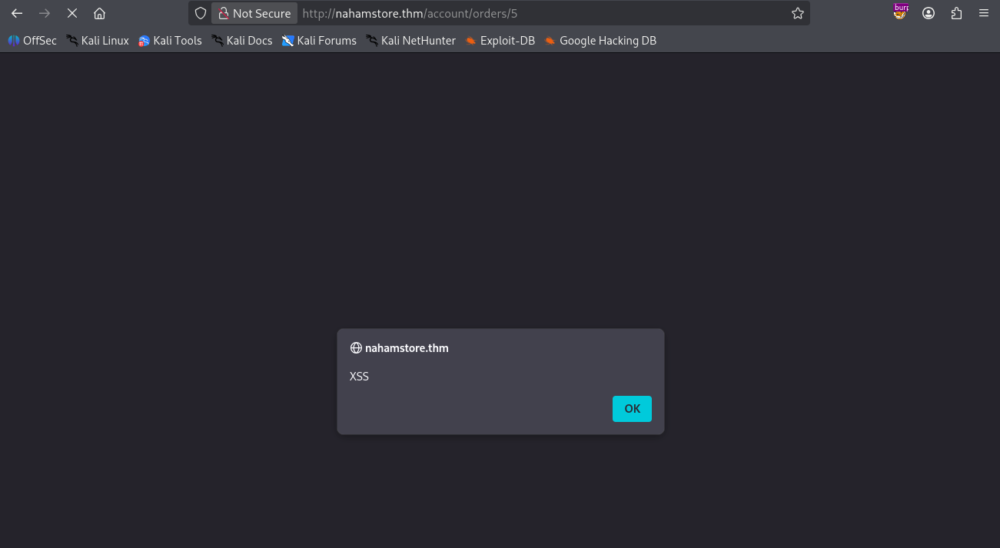
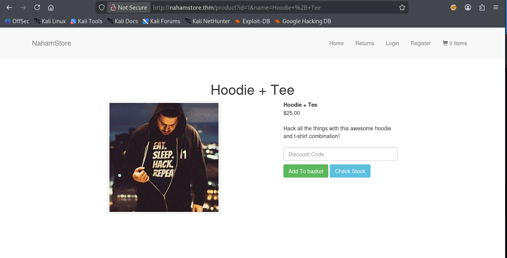
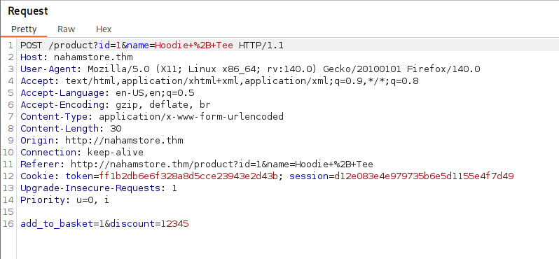

# Nahamstore | Task 4 | TryHackMe
#### Before starting this task:
* *Note*: It is very recommended to do deep recon first and know how the web application works. This will help you a lot because you will spend much less time on wrong pages and will understand the questions better.
## Question 1
Enter an URL ( including parameters ) of an endpoint that is vulnerable to XSS

### Solution
To solve this problem we should do a good recon of web application first. There are lots of endpoints that we can exploit. To find particular endpoint for `Question 1` I have done fuzzing of subdomains. You can do file and directory enumeration using both `ffuf` and `gobuster`. Choose whatever you are comfortable. I used `ffuf` and enumerated `http://marketing.nahamstore.thm/` domain and got this:
```bash
┌──(kali㉿kali)-[~]
└─$ ffuf -u http://marketing.nahamstore.thm/FUZZ \
-w /usr/share/seclists/Discovery/Web-Content/DirBuster-2007_directory-list-2.3-small.txt -t 50

        /'___\  /'___\           /'___\       
       /\ \__/ /\ \__/  __  __  /\ \__/       
       \ \ ,__\\ \ ,__\/\ \/\ \ \ \ ,__\      
        \ \ \_/ \ \ \_/\ \ \_\ \ \ \ \_/      
         \ \_\   \ \_\  \ \____/  \ \_\       
          \/_/    \/_/   \/___/    \/_/       

       v2.1.0-dev
________________________________________________

 :: Method           : GET
 :: URL              : http://marketing.nahamstore.thm/FUZZ
 :: Wordlist         : FUZZ: /usr/share/seclists/Discovery/Web-Content/DirBuster-2007_directory-list-2.3-small.txt
 :: Follow redirects : false
 :: Calibration      : false
 :: Timeout          : 10
 :: Threads          : 50
 :: Matcher          : Response status: 200-299,301,302,307,401,403,405,500
________________________________________________

# This work is licensed under the Creative Commons [Status: 200, Size: 2025, Words: 692, Lines: 42, Duration: 96ms]
#                       [Status: 200, Size: 2025, Words: 692, Lines: 42, Duration: 96ms]
# directory-list-2.3-small.txt [Status: 200, Size: 2025, Words: 692, Lines: 42, Duration: 97ms]
# Suite 300, San Francisco, California, 94105, USA. [Status: 200, Size: 2025, Words: 692, Lines: 42, Duration: 111ms]
                        [Status: 200, Size: 2025, Words: 692, Lines: 42, Duration: 192ms]
#                       [Status: 200, Size: 2025, Words: 692, Lines: 42, Duration: 195ms]
# Priority-ordered case-sensitive list, where entries were found [Status: 200, Size: 2025, Words: 692, Lines: 42, Duration: 196ms]
#                       [Status: 200, Size: 2025, Words: 692, Lines: 42, Duration: 196ms]
#                       [Status: 200, Size: 2025, Words: 692, Lines: 42, Duration: 197ms]
# on at least 3 different hosts [Status: 200, Size: 2025, Words: 692, Lines: 42, Duration: 198ms]
# license, visit http://creativecommons.org/licenses/by-sa/3.0/ [Status: 200, Size: 2025, Words: 692, Lines: 42, Duration: 199ms]
# Attribution-Share Alike 3.0 License. To view a copy of this [Status: 200, Size: 2025, Words: 692, Lines: 42, Duration: 105ms]
# or send a letter to Creative Commons, 171 Second Street, [Status: 200, Size: 2025, Words: 692, Lines: 42, Duration: 195ms]
# Copyright 2007 James Fisher [Status: 200, Size: 2025, Words: 692, Lines: 42, Duration: 202ms]
                        [Status: 200, Size: 2025, Words: 692, Lines: 42, Duration: 95ms]
cfa5301358b9fcbe7aa45b1ceea088c6 [Status: 302, Size: 0, Words: 1, Lines: 1, Duration: 95ms]
6e6055bd53afb9b6e4394d76e35838c9 [Status: 302, Size: 0, Words: 1, Lines: 1, Duration: 93ms]
:: Progress: [87664/87664] :: Job [1/1] :: 533 req/sec :: Duration: [0:02:48] :: Errors: 0 ::
```
After finding these `cfa5301358b9fcbe7aa45b1ceea088c6` and `6e6055bd53afb9b6e4394d76e35838c9` values I tried to insert them, however, I got the following error on the page:


As you can notice, the page displays the following URI:

* `http://marketing.nahamstore.thm/?error=Campaign+Not+Found`

After changing the `error=` parameter to XSS payload, we can observe that it worked!:


The **answer** for question one: `http://marketing.nahamstore.thm/?error=`

## Question 2
What HTTP header can be used to create a Stored XXS
### Solution
To understand where we can use stored XSS we should understand how web app works first. Briefly, the flow is like this: register-> add product to basket-> fill required credentials (address, card info)-> buy product. After buying product we get the following page:


The first thing we suspect is that web application stores `User-Agent` inside `Order Details`. That means we can inject XSS payload to `User-Agent` and it will store it. We can do this by intercepting the traffic using Burp Suite:

As a result we get this:


To verify it is stored XSS, we can use navigation bar and go to `Orders` and select the order with payload. Loading this order browser will execute our payload because it stored it in `Order Details`.

The **answer** for question 2 : `User-Agent`

## Question 3
What HTML tag needs to be escaped on the product page to get the XSS to work?

### Solution
The product page looks like this:


From question 1 we know that this web application might be vulnerable to URI XSS injection. The first thing I did was to change the value of parameter `id=` in URI to `<script>alert('XSS')</script>` payload. And this payload worked! Now all we have to do is to find the HTML tag that needs to be escaped. that means this tag uses parameter `id` from backend. After carefully looking at source code in inspection, we can observe this:
```html
<head>
    <meta charset="utf-8">
    <meta http-equiv="X-UA-Compatible" content="IE=edge">
    <meta name="viewport" content="width=device-width, initial-scale=1">
    <title>NahamStore - Hoodie + Tee</title>
    <link rel="stylesheet" href="https://maxcdn.bootstrapcdn.com/bootstrap/3.3.7/css/bootstrap.min.css" integrity="sha384-BVYiiSIFeK1dGmJRAkycuHAHRg32OmUcww7on3RYdg4Va+PmSTsz/K68vbdEjh4u" crossorigin="anonymous">
</head>
```
As you can see `title` tag uses `id` parameter to get the name of the product.

The **answer** to question 3 is: `title`

## Question 4
What JavaScript variable needs to be escaped to get the XSS to work?

### Solution

In order to answer this question, first we need to do a recon. After recon, I found two pages that had `Javascript` code on the most bottom of the source code using inspection. These javascript codes had some variable and functions. One of these was on `product` page, and the other on `search` page. What we need is search page. After inspecting that `<script>` code we can observe this:
```js
  var search = 'hoo';
    $.get('/search-products?q=' + search,function(resp){
  ...
```
As you can see, our input is directly parsed into function without input validation. To bypass this script, we can use the following payload:
```js
';alert('XSS');'
```
After using this input we get XSS injection because the above script becomes:
```js
  var search = '';alert('XSS');'';
    $.get('/search-products?q=' + search,function(resp){
  ...
```
We escape the string and inject our payload.

the **answer** for question 4: `search`

## Question 5
What hidden parameter can be found on the shop home page that introduces an XSS vulnerability.

### Solution
We found out that `search` on main page can be exploited after entering some malicious value. The parameter that this `search` accepts is `q=`.

The **answer** for question 5: `q`

## Question 6
What HTML tag needs to be escaped on the returns page to get the XSS to work?

### Solution
After entering the `Returns` page, we see a form that we need to complete. Careful inspection of source code shows that this form has a vulnerability. `Return Information` has `<textarea name="return_info" class="form-control"></textarea>`. This `textarea` can be easily bypassed using payload like:
```html
</textarea><script>alert('XSS')</script>
```

By injecting this into `textarea` we are closing this tag and create a new `script` tag which injects XSS.

The **answer** to question 6: `textarea`

## Question 7
What is the value of the H1 tag of the page that uses the requested URL to create an XSS

### Solution
While trying to solve question 6, I also solved question 7! I noticed that whenever we created new `return`, we had the following URI:
```bash
http://nahamstore.thm/returns/3?auth=eccbc87e4b5ce2fe28308fd9f2a7baf3
```
We already tried multiple URI payloads and they worked, so I tried to do it here too. I changes the value of parameter `auth=` to `<script>alert('XSS')</script>` and it worked!

To answer this question 7 we need to inspect the page afterwards. The inspection shows the following:
```html
<h1 class="text-center">Page Not Found</h1>
```

The **answer** for question 7 is: `Page Not Found`

## Question 8
What other hidden parameter can be found on the shop which can introduce an XSS vulnerability

### Solution
To solve this question we need to do deep recon using Burp Suite to catch the hidden parameters from URI. One of these parameters was `discount` parameter. When we enter to `product` page and we enter some value for **Discount**and add product to the basket, nothing happens. But when we use Burp Suite we see this:


As you can see `Add To Basket` has additional `discount` parameter.

We add this parameter manually to URI to check if it works and yes, it works!!! Inspecting the page after manually entering `discount` parameter we see the following:
```html
<input placeholder="Discount Code" class="form-control" name="discount" value="12345">
```
We can inject the following payload to implement the XSS injection:
```hmtl
12345"oncontentvisibilityautostatechange="alert(1)"%20 style="content-visibility:auto"
```
This payload escapes the string format and become attribute inside `input` tag.

The **answer** for question 8 is: `discount`


*As you could see, the general knowledge of how application works was very important to solve these question. Without proper understanding we could spend much more time on wrong pages.*
