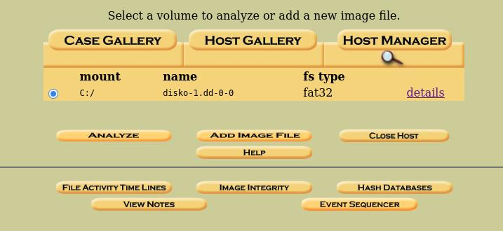
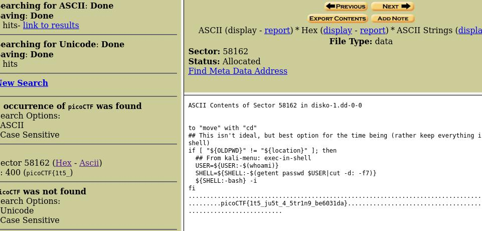

# DISKO 1 | picoCTF

This level provided us with disko-1.dd.gz file. Using archive manager, we get disko-1.dd file.

## Analysis
Search of .dd file in Google revealed that this is a disk image file. To analyze it we need to mount it, or, like me use a tool.

## Tools
 I searched what tools I can use because I did not wanted to mount it using external device. That is why I used tool called `autopsy`. I run it, created new case, chose disk image, and started to analyze. 

## Solution

I pressed analyze, then chose "Keyword Search" on the top to search for "picoCTF". And I was correct!

## Flag
Now we have the flag for this CTF!!
