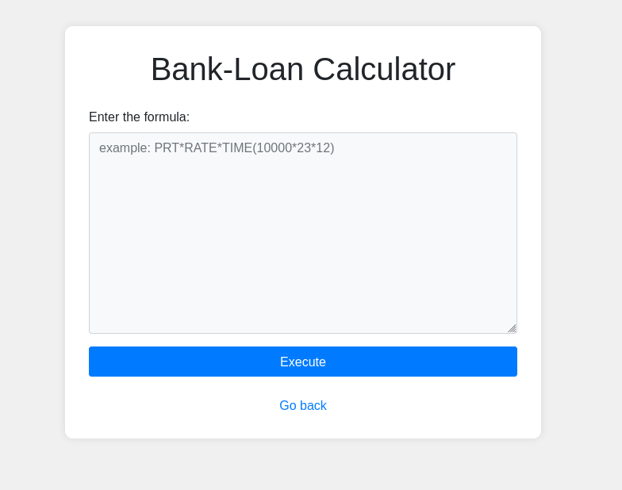
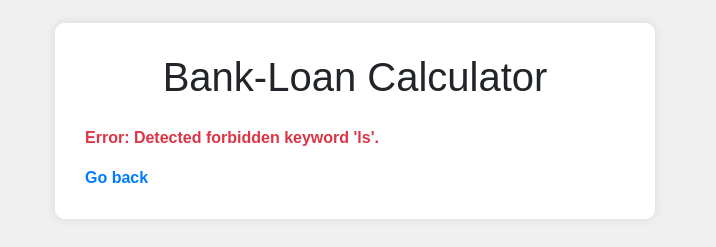
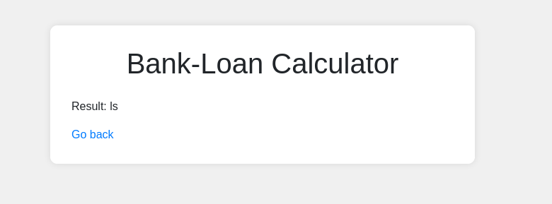
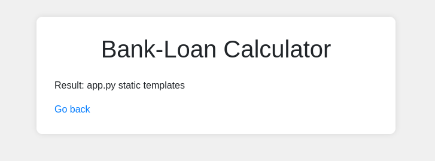
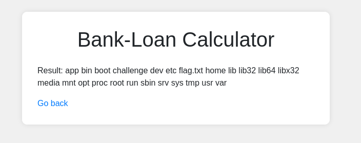
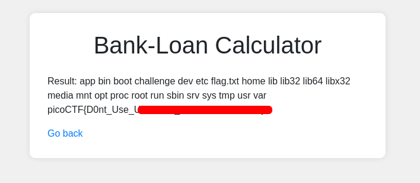

# 3v@l | picoCTF
## Description
ABC Bank's website has a loan calculator to help its clients calculate the amount they pay if they take a loan from the bank. Unfortunately, they are using an eval function to calculate the loan. Bypassing this will give you Remote Code Execution (RCE). Can you exploit the bank's calculator and read the flag?

## Analysis
When we run instance and open link, we see the following website:

It is known to us from the description that this website uses `eval()` function to take the input. After reading this, I researched this function and found out that `eval()` function is very vulnerable as it trusts user input too much. The argument is dynamically passed into this function and is executed as Python code. Therefore, we will probably will do injection attack using this information.

I tried to use basic commands like `ls`, `cd`, `cat`, however, I received the following output:


That means the following form has keyword-based input sanitization and we cannot parse whatever we like. It did not matter if I tried to parse `ls` or `"ls"`, I got the **forbidden keyword** result each time.

## Solution
Later, I tried to use obfuscation and try to bypass this input sanitization. I tried `'l'+'s'` and got the following result:


There we go! That means the forbidden keywords are **blacklisted**. That means this application blocks only some of the keywords, not all of them. That is why this approach is insecure and it is possible to bypass it.

It is time to use our python payload:
```python
__import__('o'+'s').popen('l'+'s').read()
```
This payload imports os library and runs `ls` command to list the directory in current folder. We use `read()` function so we can read the output.
We got the following output:


That means our payload in combination with out obfuscation works! Like that we exploited **Remote Code Execution**. Now all we need to do is to abuse commands to find our flag:
```python
__import__('o'+'s').popen('c'+'d'+' .'+'.'+' ; '+'l'+'s').read()
```
As you can see we used `;` here: it helps us to use command chaining.


## Answer
We can finally get the answer by using:
```python
__import__('o'+'s').popen('c'+'d'+' .'+'.'+' ; '+'l'+'s'+' ; '+'ca'+'t' +' flag'+'.'+'txt').read()
```


## Remediation
To secure ourselves from this type of injection and RCE attacks we should be very careful with our function and code we are writting. In this case it was function `eval()`. There are several things to do to prevent this:
* Always use user input validation and sanitization
* Avoid dynamic code execution at runtime: use safe parsing or predefined operations instead.
* Use whitelist, not blacklist: whitelist allow only specified inputs, the rest is forbidden. Blacklists, however, forbid some input. Hackers are creative and can easily bypass these restrictions.
