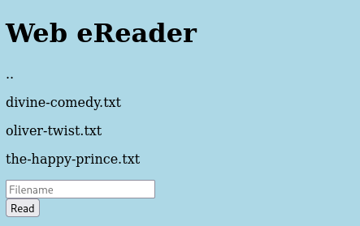
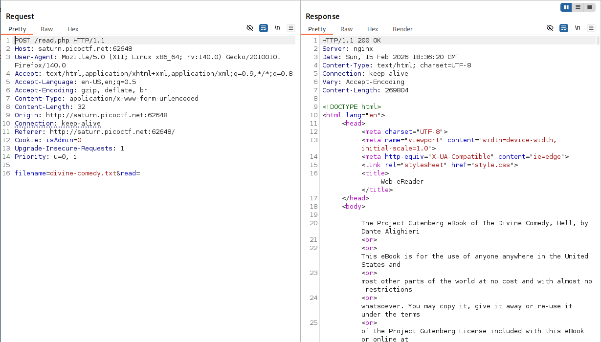
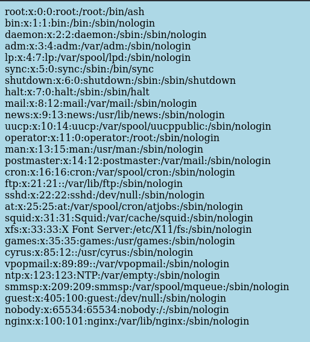

# Forbidden Paths | picoCTF
## Description
Can you get the flag? We know that the website files live in /usr/share/nginx/html/ and the flag is at /flag.txt but the website is filtering absolute file paths. Can you get past the filter to read the flag?
## Analysis
This CTF's webpage looks like this:

I tried to read some of the example files using Burp Suite to see the Requests and Responses:

As you can see when we enter the name of the file, the webpage reads it. In the Request we can observe `Cookie: isAdmin=0` header. I tried to change it to `1` and then read `flag.txt` file but could not. I also tried to use that modified cookie to read `/usr/share/nginx/html/` but webpage still responded with `Unauthorized`

## Solution

To solve this problem I decided to use **LFI Vulnerability**. LFI Vulnerability is OWASP top 10 web vulnerabilities, stands for Local File Inclusion and it is a technique in which attackers trick a web application into either running or exposing files on a web server.

In this CTF challenge we will use path traversal to bypass the input filter and read `flag.txt`. Our payload will be `../../../../../flag.txt`. Let's explain why:
* We know that current files of webpage lives in `/usr/share/nginx/html/` and we know that we need to read `/flag.txt`. `../` means **move up one directory level**. So if we use `../../flag.txt` in the web page, it will look in `/usr/share/flag.txt` because we moved up two times. Now, to move up all the way to `/flag.txt`, we need to move up at least 4 times. Why our payload has 5 `../` then? Because after reaching root folder using `../`, the additional `../` will be "ignored" because we are already in the root folder and we cannot go up anymore in directory level. So 5 times `../` kind of guarantees us to be in the root folder.

## Answer
After using `../../../../../flag.txt`, we get the following output:

Using this vulnerability, we can even read very important `/etc/passwd`:

This is how we solve the current CTF challenge!!
