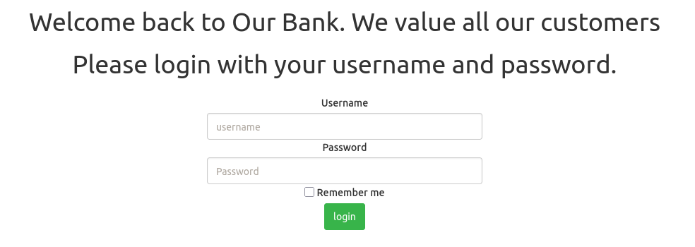
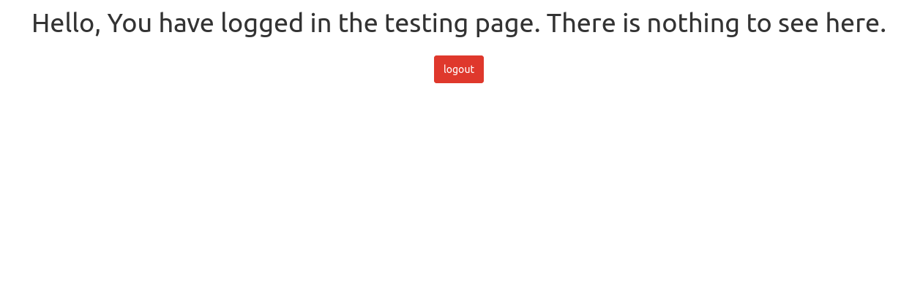
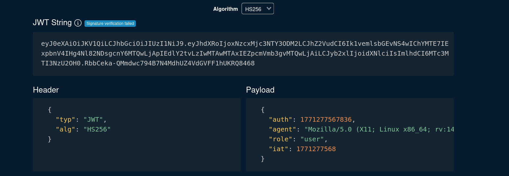
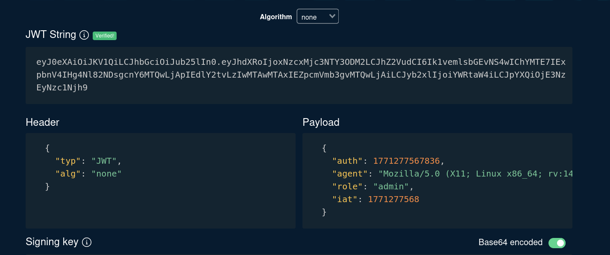
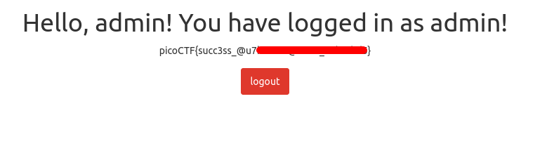

# JAuth | picoCTF
# Description
Most web application developers use third party components without testing their security. Some of the past affected companies are:

    Equifax (a US credit bureau organization) - breach due to unpatched Apache Struts web framework CVE-2017-5638
    Mossack Fonesca (Panama Papers law firm) breach - unpatched version of Drupal CMS used
    VerticalScope (internet media company) - outdated version of vBulletin forum software used

Can you identify the components and exploit the vulnerable one?

## Analysis
When we open the page we see the following:


I used given test credentials to login to see the output and this is what I got:


As there was nothing else to observe I used Burp Suite to see the Requests and Responses:


As you can see whenever we login, we send Request with `Cookie: token=..` header. First thing that came to my find is to use some JWT decoder to find out what we have. I used website called `token.dev`:


As you can see current JWT uses `HS256` hashing, and out payload looks like this:
```js
{
  "auth": 1771277567836,
  "agent": "Mozilla/5.0 (X11; Linux x86_64; rv:140.0) Gecko/20100101 Firefox/140.0",
  "role": "user",
  "iat": 1771277568
}
```
## Solution
I tried to change `role` from `user` to `admin` but it did not work. Then I decided to change the hashing function from `HS256` to `none` to test JWT   token without signature. 
* ***Note***: JWT generally consists of three parts with 2 separator: `header.payload.signature`. `header` shows the type of token and it's hashing method: in our case it was `typ` was `JWT` and `alg` was `HS256`. Payload is `base64` encoded information about the user that can be publicly accessed. And finally `signature` part is created based on the `header`+`payload`+`secret key` combination. Unless you do not know the `secret key`, decoding hash will be very difficult.

So after changing `alg` to `none` token looked like this:


## Answer
Now all we have to do is to go to `Inspection`=>`Storage`=>`Cookies` and edit the token there by double pressing it. It is **important to add `.` at the end of our token to make it valid** as JWT needs two separators. Completing these steps will reveal us `admin` page:

