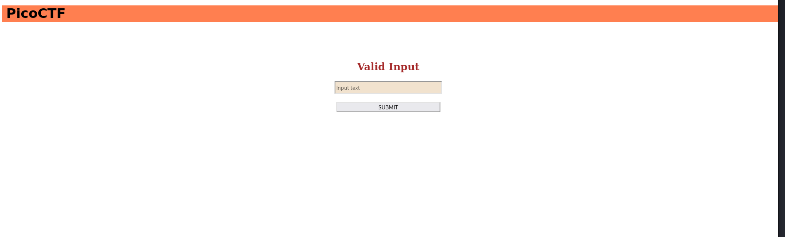
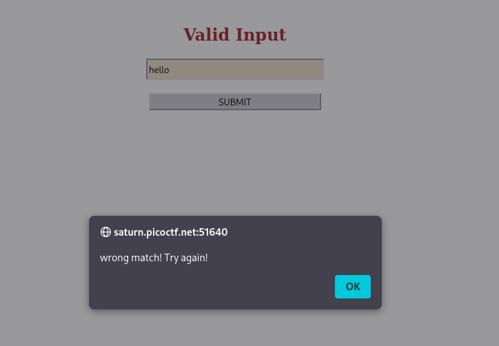
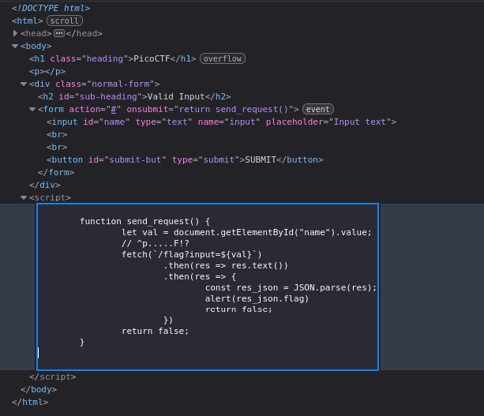

# Match The Regex | picoCTF
## Description
How about trying to match a regular expression

## Analysis
This website has input form where we need to submit our string:


At first I tried to submit some arbitrary string to test the output and got the following output:


The first thing I tried was to inspect the page. After inspecting the page I found something interesting:


We can observe that input form uses `return send_request` in its form element:
```js
<form action="#" onsubmit="return send_request()">
			<input type="text" id="name" name="input" placeholder="Input text">
			<br>
			<br>
			<button id="submit-but" type="submit">SUBMIT</button>
		</form>
```

And if we look a little bit down, we can see the implementation of that `send_request` method:
```js
function send_request() {
		let val = document.getElementById("name").value;
		// ^p.....F!?
		fetch(`/flag?input=${val}`)
			.then(res => res.text())
			.then(res => {
				const res_json = JSON.parse(res);
				alert(res_json.flag)
				return false;
			})
		return false;
	}
```
We notice interesting hint here:
```js
// ^p.....F!?
```
This is a regular expression, and this comment hints at the regex that the backend uses to validate our input.

## Solution

To solve this regex matching, first we need to understand how **regex** works:
* In regex, `^` sign **forces** string to start with the character after it. In our case, we have `^p`, which means our input should start with character `p`.
* `.....` => five dots means that after `p` we can have **any** five characters. It is also possible to compress that regex into `.{5}` which is essentially the same but cleaner.
* `F` after 5 dots means our string should have 1 *capital* `F` character right after 5 arbitrary characters (5 dots). If we use `f`, regex will reject our string.
`!?` => in regex `?` means **1 or 0**. In this case, it shows that our string may either have `!` character after `F` or it may not. So `!` is optional.

**Note:** Actually, regex should have `$` character to show end of the string. But in our case regex does not have it. That means we can use strings like `p12345FHelloWorld` or `p12345F<script>alert(1)</script>` which may lead to XSS injections based on how function interprets our string.

## Answer
Now we can submit any string that matches `^p.....F!?` regex and get the flag for this solution. Some of example strings:
```bash
p12345FHelloWorld
p12345F
picoCTF
...
```

## Remediation
This CTF is designed specifically to solve it, so it is not very realistic to see `^p.....F!?` in real world applications. However, there are still some things to avoid vulnerabilities:
* Anchor regex with `^` and `$`. Without end of string, users can implement XSS injections like `p12345F<script>alert(1)</script>`
* Limit users to use `a-z`, `A-Z`, `0-9` in authentication and other input forms as usage of characters like `'`, `{`, and `<` lead to SQL, SSTI, and XSS injections.
* Do not rely on regex alone for security
* Use proper output encoding (not regex). Validate input **and** output.
