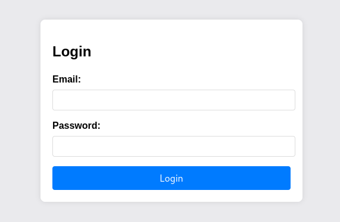
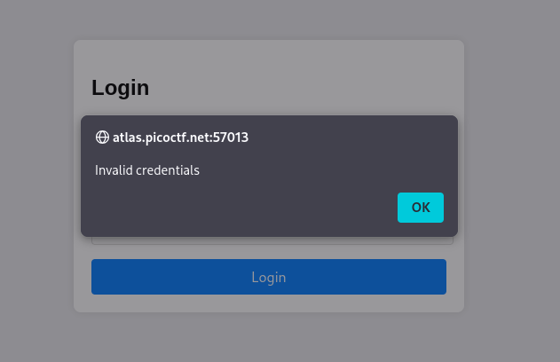
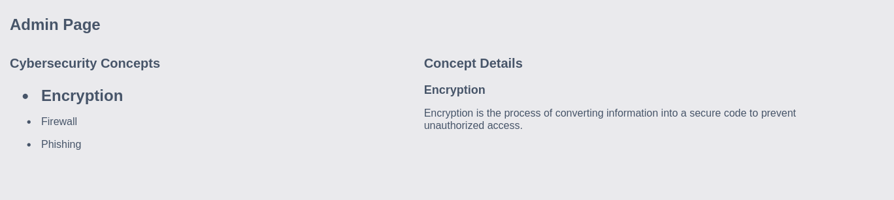
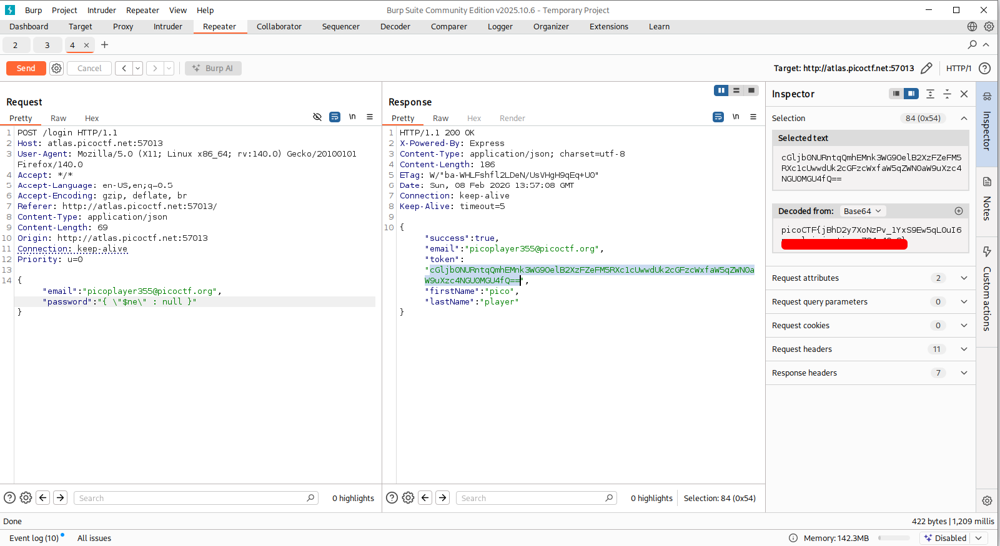

# No Sql Injection | picoCTF
## Description
Can you try to get access to this website to get the flag? You can download the source `here`.

## Analysis
We are given an archive and a webpage in this CTF challenge. Extracting given archive gives us `app` folder, which contains `html`, `json`, and `js` files. We will come to them later. When we move to the webpage, we observe the following login page:


I entered arbitrary credentials to see the output for wrong credentials:


So we get nothing really interesting here. Inspection of the webpage also does not give anything interesting. I decided to look at the downloaded files.

In downloaded files we have `admin.html`, which gives us information about some cybersecurity concepts, but I did not find anything useful there:


The next file is `index.html` which redirects us to the login page, so I got nothing out of it.

3rd file was `package.json` file. Opening it we got the following output"
```json
{
  "name": "api-form",
  "version": "1.0.0",
  "description": "",
  "main": "index.js",
  "scripts": {
    "test": "echo \"Error: no test specified\" && exit 1"
  },
  "keywords": [],
  "author": "",
  "license": "ISC",
  "dependencies": {
    "body-parser": "^1.20.2",
    "express": "^4.19.2",
    "mongodb-memory-server": "7.0.0",
    "mongoose": "^6.9.1"
  }
}
```
As we can observe, the following server uses **MongoDB**.

The last and the most important file was `server.js` file. This file has important information:
```bash
const userSchema = new mongoose.Schema({
  email: { type: String, required: true, unique: true },
  firstName: { type: String, required: true },
  lastName: { type: String, required: true },
  password: { type: String, required: true },
  token: { type: String, required: false, default: "{{Flag}}" },
});
```
Here we can see user properties. What catches our attention is `token` property, which is set to `{{Flag}}` on default. That will be our flag probably later on.

```bash
 // Store initial user
    const initialUser = new User({
      firstName: "pico",
      lastName: "player",
      email: "picoplayer355@picoctf.org",
      password: crypto.randomBytes(16).toString("hex").slice(0, 16),
    });
    await initialUser.save();
```
This server already has initial user with email `picoplayer355@picoctf.org`. However, we cannot really get the password as it is not given to us.

```bash
try {
        const user = await User.findOne({
          email:
            email.startsWith("{") && email.endsWith("}")
              ? JSON.parse(email)
              : email,
          password:
            password.startsWith("{") && password.endsWith("}")
              ? JSON.parse(password)
              : password,
        });
```
This is the process of handling login by submission with JSON. We can observe very strange behaviour here: the logic checks for `{` and `}` braces and if this returns true, it parses the email and JSON. This handling introduces a critical vulnerability as it can be bypassed by injection attacks. Our main goal will be bypassing this logic.

## Solution
After recon we can make a clear statement: login form is vulnerable to injection attacks, it sends request to MongoDB to retrieve the user. That means we can exploit this login form and get access to users data. 

To do so, first we need to take a closer look into login form logic. From the ternary login logic, if email or password start with "{" and end with "}" it parses email as JSON. As you remember, previously we found out that this server uses MongoDB and has initial user with leaked email. Combining all these facts we get **NoSQL Injection**.

Let's dive into MongoDB a little deeper:
* In JSON `$` sign has no special meaning: just a data format and a normal character inside a string or key. However, MongoDB treats `$` very differently: it treats is like **operator**. Some of the operators in MongoDB are:
    1) `$ne` => not equal
    2) `$gt` => greater than
    3) `$or` => logical OR operator
    4) `$set` => used in updates
As you can see, we can parse an operator to MongoDB inside JSON object.

To implement our payload, we need to check what we have: a leaked email and unknown password. Using `$ne` operator we can parse JSON object for password field:
```bash
{ \"$ne\" : null }
```
Logic form will parse this password as JSON because it starts and ends braces. So when we combine email `picoplayer355@picoctf.org` with password `{ \"$ne\" : null }` we basically say "Give me a user with picoplayer355@picoctf.org email which password is not null". That's it, we bypassed authentication and logged in as the existing user. 

## Answer
Let's implement our solution with BurpSuite Repeater:


As we observed previously, when we decode user's token from `Base64` we get the flag for this CTF!

## Remediation
To avoid NoSQL injection we always need to have input validation and sanitization:
* Disable parsing of JSON from form inputs
* Password, token should not be visible in plain text
* Never pass user input directly into MongoDB query objects
* Explicitly cast inputs to strings
