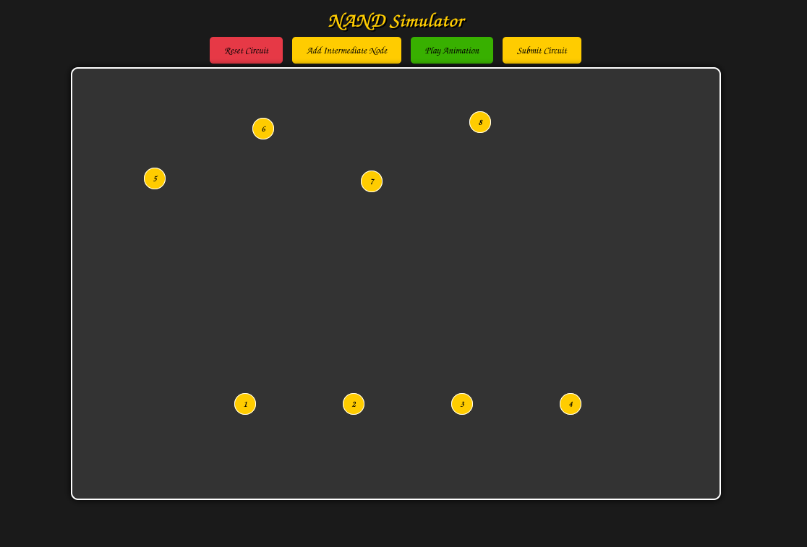
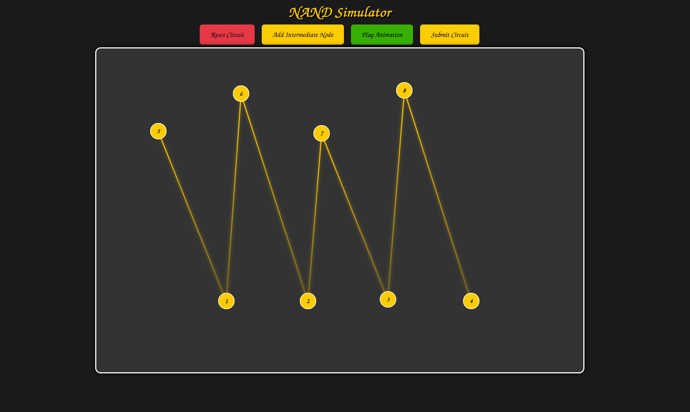
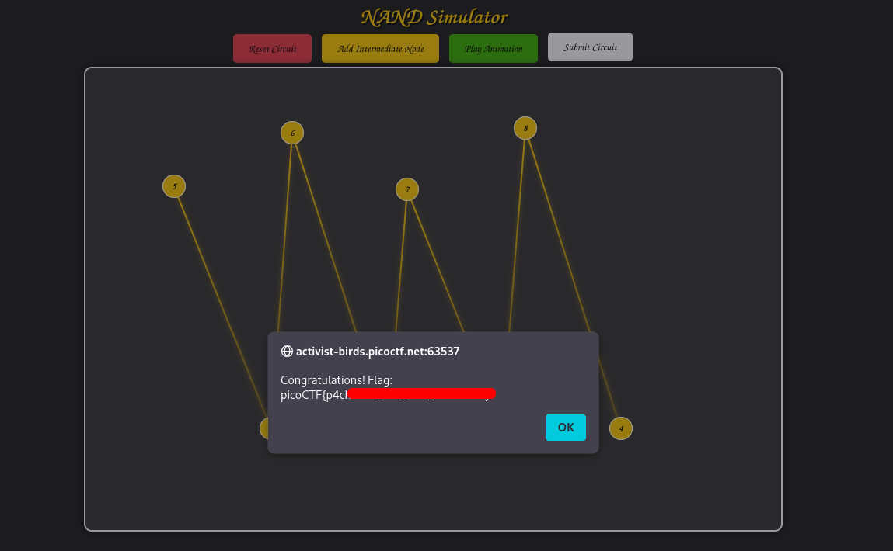
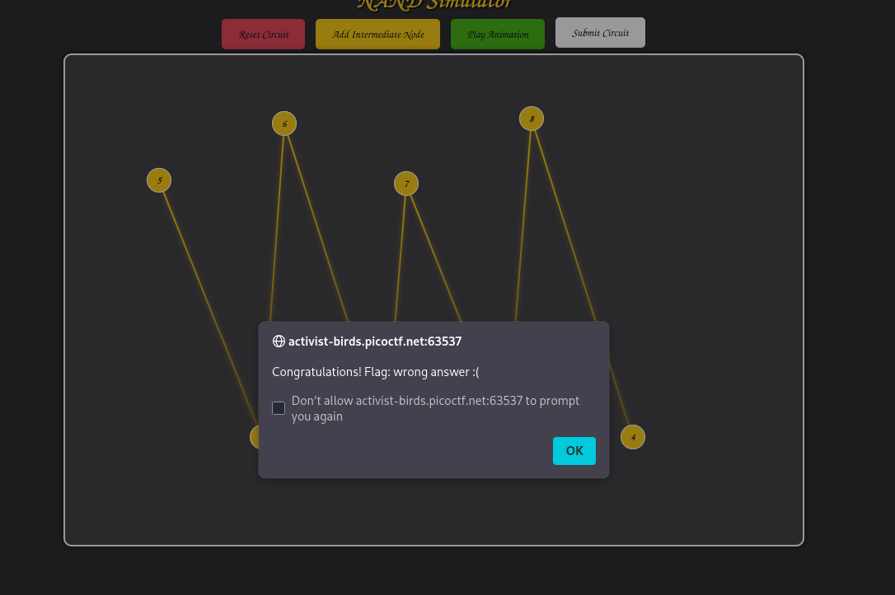
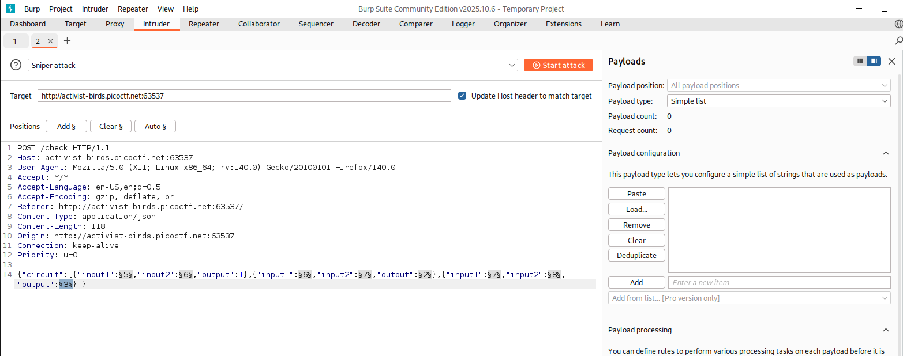
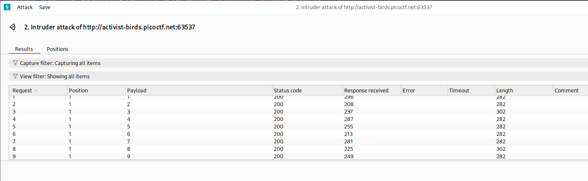
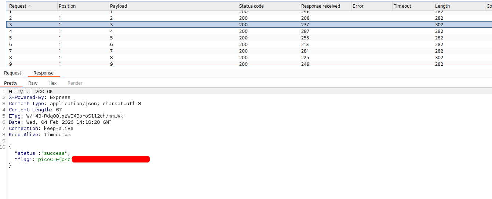

# Pachinko | picoCTF
## Description
History has failed us, but no matter. 

Server source

There are two flags in this challenge. Submit flag one here, and flag two in Pachinko Revisited.

## Analysis
When we open the website, we see the following **NAND Simulator**:

At first I tried to build some random circuit and tried to submit it to see the output:

However, I was suprised that it actually worked!:

I thought maybe there is some bug in the CTF, so I pressed **submit** again and got the following result:

Later, I pressed submit again and got flag again. This behaviour was very similar to **Race Condition**. Race Condition - a software vulnerability or bug occuring when multiple threads or processes access shared data concurrently. Therefore, output depends on the unpredictable timing or sequence of execution.

I also testes this with *Burp Suite Intruder* to test my theory. I used sniper attack to send multiple requests very frequently to force race condition:

I also created `list.txt` file which is a sequence of numbers from 1 to 30 to brute-force the requests:

As you can see most of these outputs have same length of 282. However, we can notice that some responses have lengths of 302. When we open them, we do see the flag for this CTF:

This confirms my theory about **race condition**.
