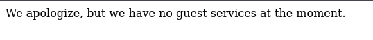
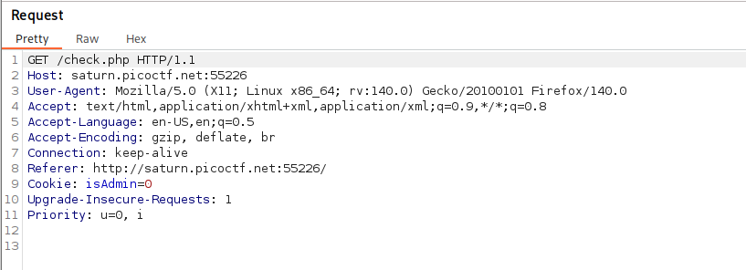
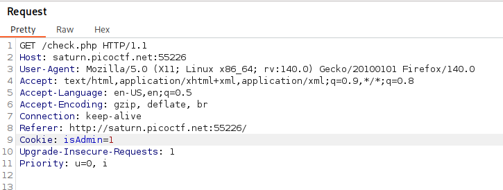
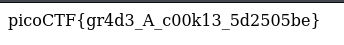

# Power Cookie | picoCTF
## Description
Can you get the flag?

## Analysis
Opening the instance gives us the following webpage:

When we press `Continue as guest` webpage replies with:

Because there is nothing more to observe I started to use Burp Suite and got interesting `Request`:

As you can see we have `Cookie: isAdmin=0` header in the request when we are pressing `Continue as guest` button.

## Answer
To solve this CTF all we need to do is to change the flag `isAdmin` from 0 to 1:

After sending the modified request we get the following page with flag:

As you can see, we solve this very easy CTF challenge!
