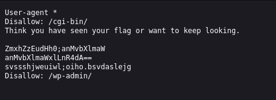
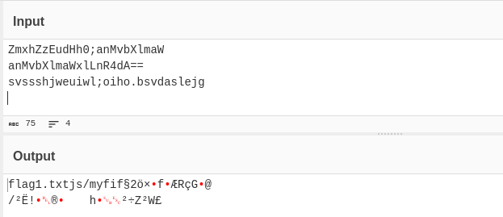
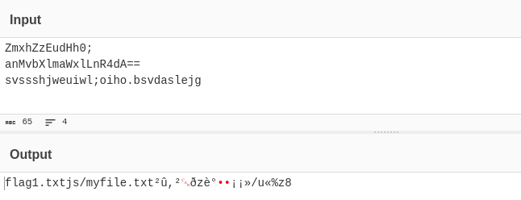

# Roboto Sans | picoCTF
# Description
The flag is somewhere on this web application not necessarily on the website. Find it.

## Analysis
After moving to the given page we see the following:


I searched the website did not find anything useful for us. Then, like description said, I tried to search "around" the website. I used inspection to look for something interesting but yet again found nothing. 

What I found interesting was searching for `/robots.txt`. When we search for it we see:


After finding nothing in `/cgi-bin/` and `/wp-admin/`, I decoded the following text:
```bash
ZmxhZzEudHh0;anMvbXlmaW
anMvbXlmaWxlLnR4dA==
svssshjweuiwl;oiho.bsvdaslejg
```

To decode each part of this `Base64` I used popular website called **CyberChef**:


As you can see we got a string saying `flag1.txt`. I tried to use it in the URL but unfortunately it did not work. Then I started to analyze this encoding more carefully. As you can see we got two `anMvbXlmaW`. I tried to remove one and got the following result:


As you can see we extracted something more: `js/myfile.txt`.
## Answer
I tried to parse that `js/myfile.txt` to the URL and got the following:


That is how we solve this CTF!
