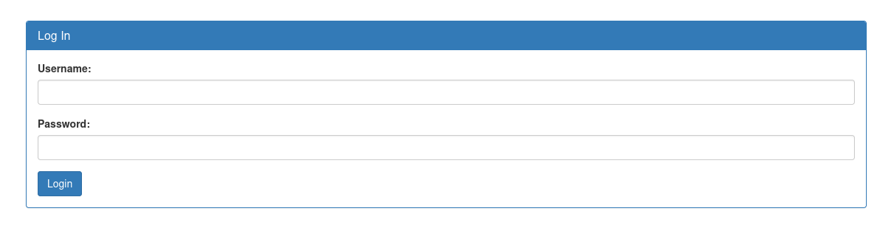
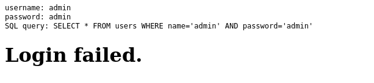
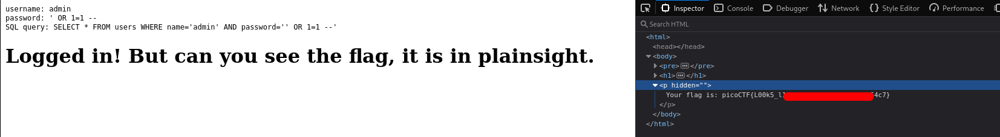

# SQLiLite | picoCTF
## Description
Can you login to this website?

## Analysis
When we open the webpage, we see the following image:


First instinct was to try some arbitrary credentials like `admin` for username and password. After entering wrong credentials we get this output:


Here we are given the query logic behind this website:
```sql
SELECT * FROM users WHERE name=`admin` AND password=`admin`
```
It is clear that this website is vulnerable to SQL injection because it directly parses user input into the SQL query without sanitization.
## Solution
To bypass authentication we need to have basic knowledge of SQL. When query is not validated and sanitized, characters like `'` can become very malicious. As you can see, the query that we found above searches our input inside database the way we entered it. That means if we enter `abc' OR 1=1 -- ` value to the password field, that SQL query will always return us true. This bypass method is very known SQL injection type. Now let's explain the following payload query a little bit more:
```sql
SELECT * FROM users WHERE name='admin' AND password=`' OR 1=1 --`
```
* `SELECT * FROM users` => this command searches for all columns inside `users` table and returns them.
* `WHERE` => filters the return data according to some condition. In our case it filters the returned data based on password and username.
* `password` and `username` => these are columns inside `users` table, so nothing special
* `' OR 1=1 --` => now comes interesting stuff. Why this payload works? Because adding `'` to the password ends completes the value that we are trying to pass to the password. In our example, `'` makes the value given to the password field equal to `abc` and the rest of the code will be out string input. Logical `OR = 1=1` returns always true because 1 is always equals to 1. That is how we set the password field to always true and bypass it. `--` comments the rest of the line in SQL. In our case it is used to comment out `AND username = 'admin'` as we want our query condition be always true.

So the used payload looks like this:
```bash
username = admin (can be anything, doesn't really matter, but usually admin is better)
password = ' OR 1=1 -- 
```

## Answer
After we saw how SQLi works, lets see how we can apply it. I used Burp Suite Repeater to send requests and view responses:


As you can see this is a very basic SQL injection that requires basic knowledge of SQL!!

## Remediation
To avoid SQL injections:
* Input should never be directly parsed into query
* Input should always be validated and sanitized
* ORM usage
* You should never expose the names of tables, columns, databases, etc.

