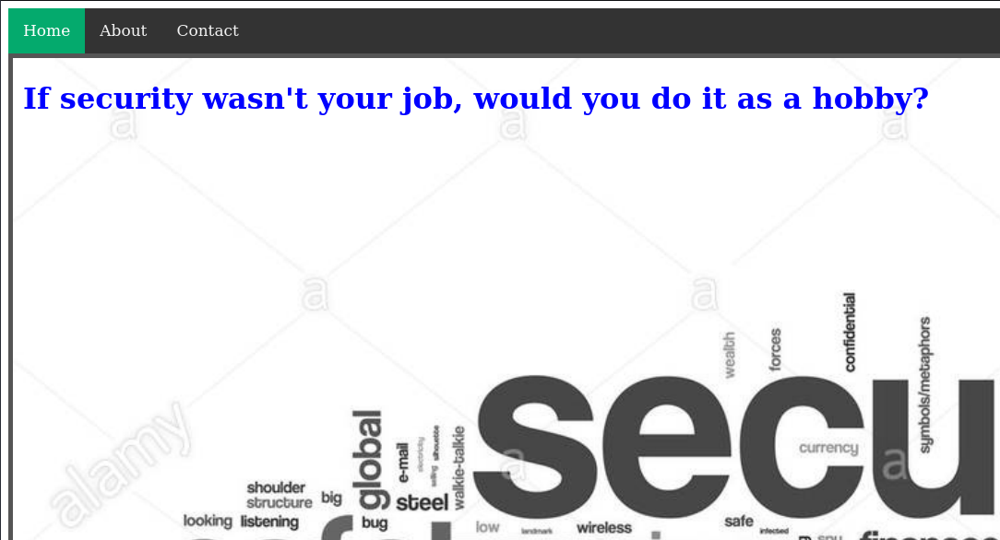
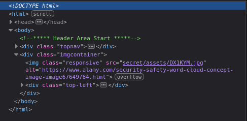
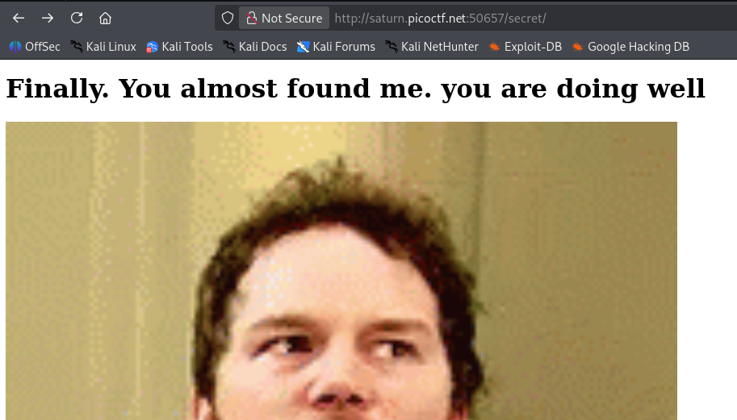
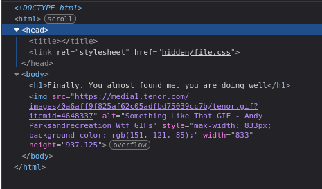
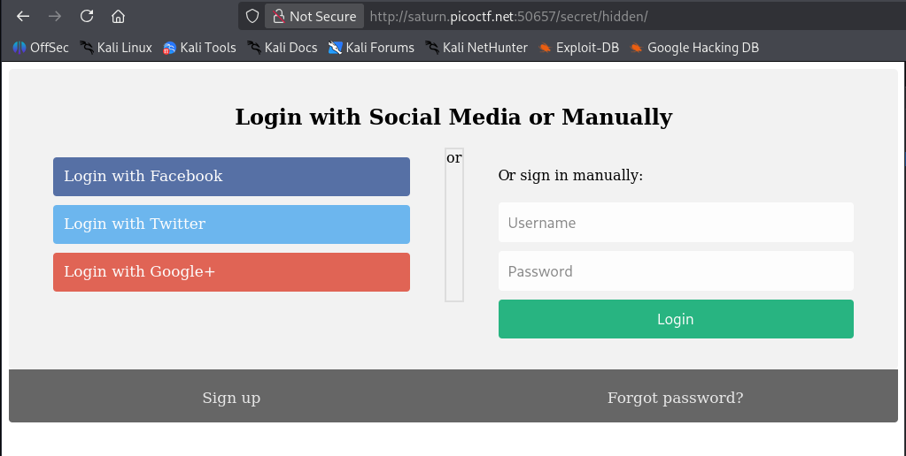
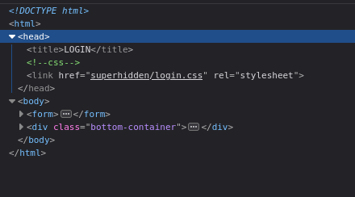
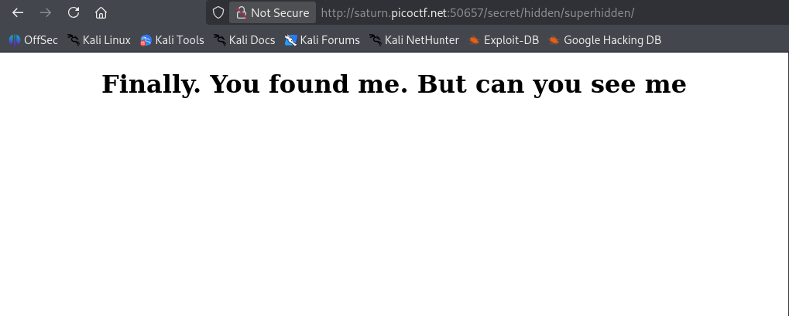
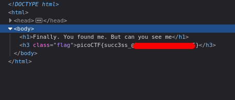

# Secrets | picoCTF
## Description
We have several pages hidden. Can you find the one with the flag?

## Analysis
When we open the link we see the following page:

I looked around in `Home`, `About`, and `Contact` pages but nothing intersting showed up. This is when I started the inspection of the page.

## Solution
During the inspection I found this:

As you can see we have some `secret/assets/` folder. I tried to move to it, but it gave me **Forbidden**. That is when I tried to navigate to `/secret/` folder and it worked:

After inspecting this page, I found the following:

After moving to `/secret/hidden/` folder we get the following page:

Yet again we inspect the page and find this:

## Answer
After finding `/secret/hidden/superhidden/` path, we see the following:

Finally, we inspect this page too and retrieve the flag:

