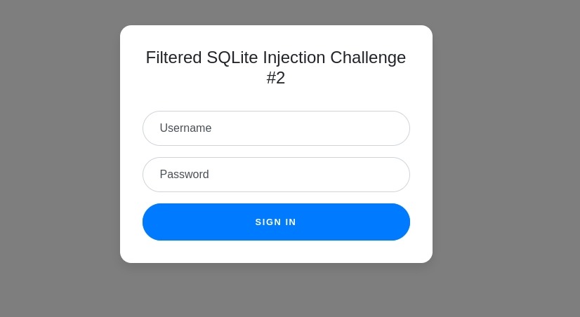
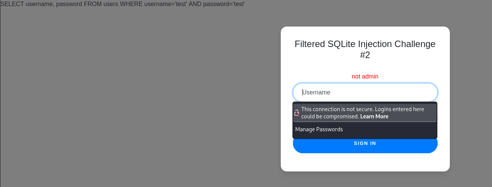
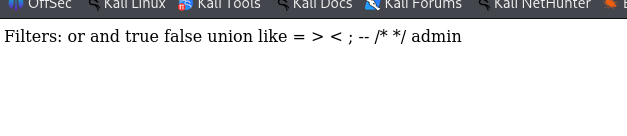
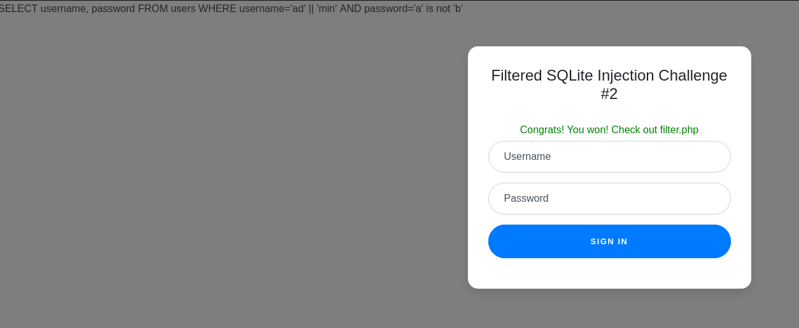
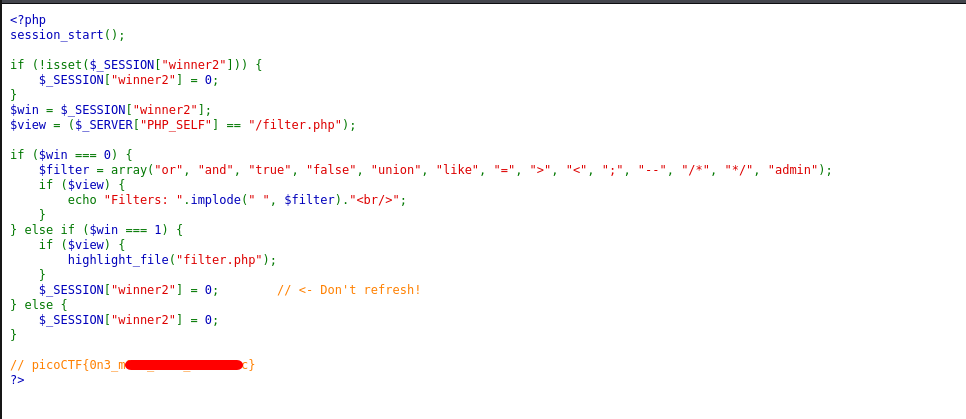

# Web Gauntlet 2 | picoCTF
## Description
This website looks familiar...

## Analysis
When we open the provided link, we get the following page:


Firstly, I tried to use some arbitrary credentials like `test` and `test`. This is the output I got:


As you can see we got multiple details:
* The server uses the following query:
```sql
SELECT username, password FROM users WHERE username='test' AND password='test' 
```
* It says that username is not admin, which indicates that we need to login as admin.

Basic payloads will not work because we have `/filter.php` page that shows this website uses filters:


## Solution
As we can observe, this webpage has big vulnerability: it uses blacklist filtration instead of whitelist. That means if we come up with some way to bypass those filtered words, we can use SQL Injection.

1) To bypass `admin` filter, we can simply use SQL string concatenation. String concatenation will be like this: `ad' || 'min`. When SQL parses this to username, it will look like this: `username = 'ad' || 'min'`. As a result username will be admin and we will bypass filter.

2) To make password always true, I used the following payload: `a' is not 'b`. The SQL will insert it into query and it will be like this: `password = 'a' is not 'b'` which is always true.

By injecting the given payloads we can easily bypass this blacklist filters.

## Answer
After inserting these payloads, we get the following outputs:


