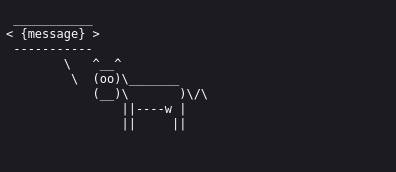
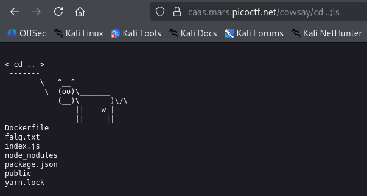
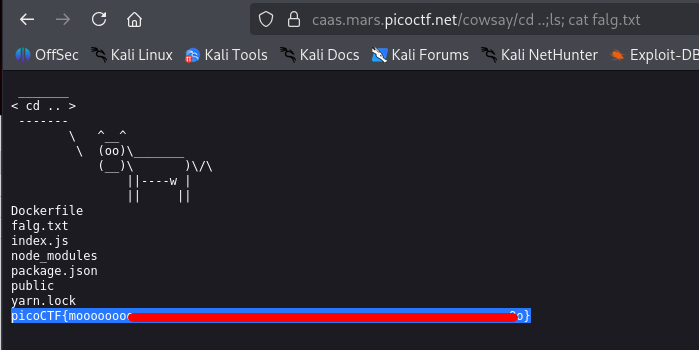

# caas | picoCTF
## Description
Now presenting cowsay as a service

## Analysis
Opening the link will give us the following:


As you can see, we can make a request to the given URL to make cowsay our message:


Basically, when we change the `{message}` part in the `https://caas.mars.picoctf.net/cowsay/{message}`, it will output it on this page.

## Solution
We are given the following `index.js`:
```js
const express = require('express');
const app = express();
const { exec } = require('child_process');

app.use(express.static('public'));

app.get('/cowsay/:message', (req, res) => {
  exec(`/usr/games/cowsay ${req.params.message}`, {timeout: 5000}, (error, stdout) => {
    if (error) return res.status(500).end();
    res.type('txt').send(stdout).end();
  });
});

app.listen(3000, () => {
  console.log('listening');
});
```
As you can see, the given snippet imports Express framework, application instance (`app`), and `exec` function from Node's built in `child_process` module that lets us run shell commands. After seeing that we can run shell commands what is the first thing that comes to mind?)

## Answer
The very first thing that came to my mind was to use `cd ..; ls` command to see if our Remote Code Execution works:

Works like a charm!

Time to retrieve the flag:



