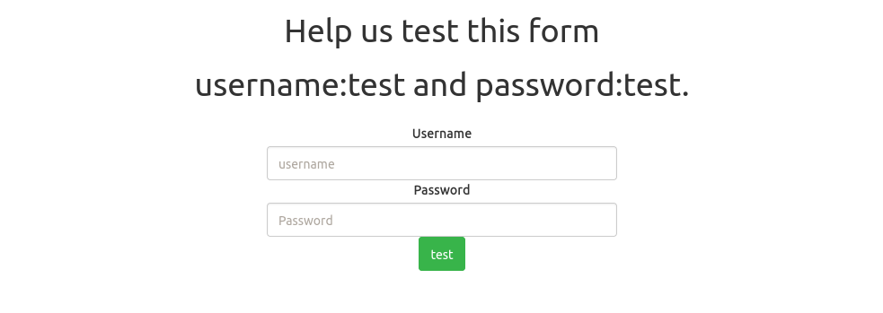
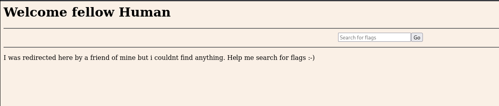
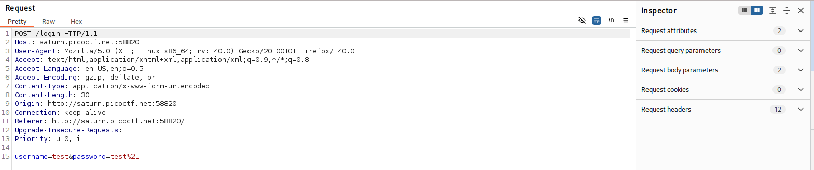
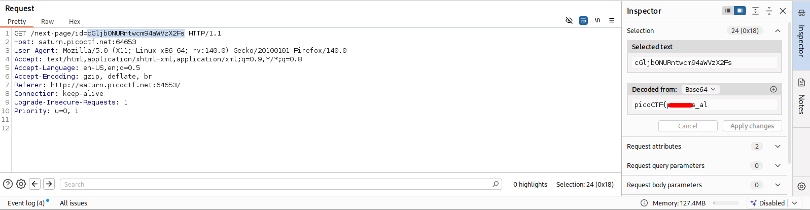
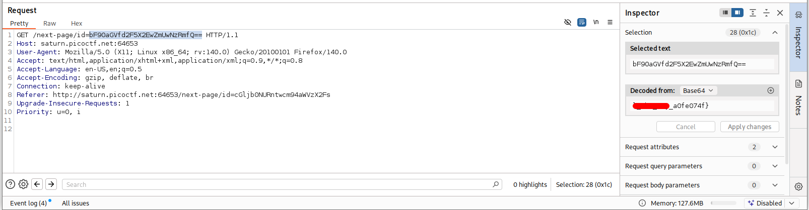

# findme | picoCTF
# Description
Help us test the form by submitting the username as test and password as test!
## Analysis
When we open the page, we see following login form:

To login we can use the given username `test` with password `test!`. After logging in using these credentials, we are redirected to the following page:

I tried to inspect both login and welcome page, nothing interesting showed up. Then I tried to use arbitrary values for `Search for flags` forms, still nothing. That is when I started to use Burp Suite.

## Solution
I analyzed all requests from login page till welcome page and found something very interesting:

This is my login submit request. Interesting part starts after this one.

After logging in, using Burp Suite we can observe that the server responded with multiple HTTP 302 redirects. By analyzing the `Location` and `Referer` headers in Burp Suite, we discovered that each redirect leaded a portion of the flag:

## Answer
As you can see, each referer had part of the flag for this CTF challenge. This is how we solve this very simple CTF!

## Lessons Learned
* Always inspect redirect chains.
* Sensitive data should never be exposed in HTTP headers.
* Proxy tools like Burp Suite are essential for observing hidden behaviour.
