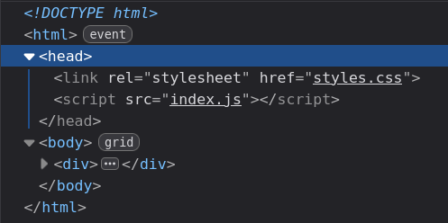
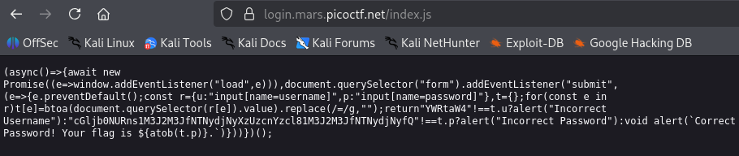
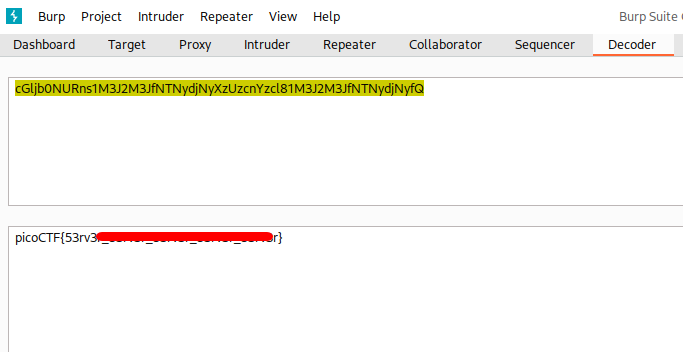

# login | picoCTF
## Description
My dog-sitter's brother made this website but I can't get in; can you help? login.mars.picoctf.net

## Analysis
The given page consists of simple login form:

The first thing that I noticed on this webpage is very explicit errors. I tried both `test` and `admin` as *username* and *password* and in first one I got `Incorrect Username` and in second one I got `Incorrect Password`. Using this information, I attempted a "quick" brute-force. 

## Solution
While waiting for brute-force to be completed, I started to inspect the page to see if I can find something interesting. And I found it!

When we open `Inspection` we can observe the following `header`:

I noticed that this webpage uses script called `index.js`. I changed the URL to `https://login.mars.picoctf.net/index.js` and got the following result:

In the following page the string `cGljb0NURns1M3J2M3JfNTNydjNyXzUzcnYzcl81M3J2M3JfNTNydjNyfQ` looked very suspicious and encoded, so I decided to try my chance to decode it using `base64`

## Answer
My intuition was correct and I got the following result:

So, instead of waiting for brute-force to finish, I just solved this CTF by simple recon!
